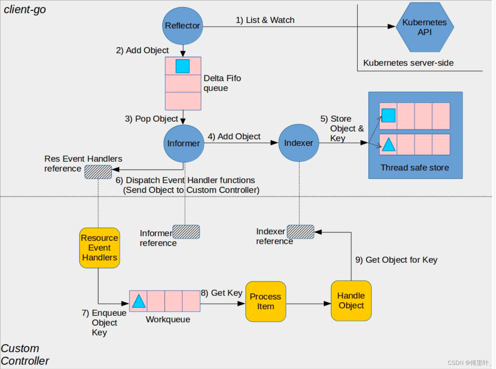

## 使用套路
informer 使用套路（其中略去一些细节，具体参考[informers demo](https://github.com/kubernetes/client-go/blob/master/examples/workqueue/main.go)）:

```
# 1. 创建 k8s client 对象：
cfg, err = clientcmd.BuildConfigFromFlags(masterURL, kubeconfig)
kube_client, err = kubernetes.NewForConfig(cfg)

# 2. 创建资源 informer，以 POD 为例：
factory = kubeinformers.NewSharedInformerFactory(client, 0)
pod_informer = ctrl.factory.Core().V1().Pods()

# 3. 注册回调函数，用来处理 Add、Update、Delete 事件：
pod_informer.Informer().AddEventHandler(handler)

handler 实现了 OnAdd、OnUpdate、OnDelete 三个接口的:
type handler struct  {
    queue: workqueue.NewRateLimitingQueue(workqueue.DefaultControllerRateLimiter())
    OnAdd: func (obj interface{}) {
        ......
        queue.Add(cache.MetaNamespaceKeyFunc(obj))
        ......
    },
    OnUpdate: func(obj, obj interface{}) {
        ......
        queue.Add(cache.MetaNamespaceKeyFunc(obj))
        ......
    },
    OnDelete: func(obj interface{}) {
        ......
        cache.DeletionHandlingMetaNamespaceKeyFunc(obj)
        ......
    },
    Task: func() {
        key, quit := c.queue.Get()
        defer c.queue.Done(key)
        ......
    }
}

# 4. 启动 informer 
factory.Start(stop)
```

informers 包中提供了工厂类，通过调用接口`factory.Core().V1().Pods()`创建 k8s pod informer 对象，其他 k8s 内置资源类同。informer 封装都在 `k8s.io/client-go/pkg/informers` 包中。

## 执行逻辑



### eventhandler 回调函数注册和执行过程

```
type sharedIndexInformer struct {
    // 带索引资源 cache
    indexer    Indexer
    // 资源控制器，负责:
    // 1. 启动 reflector list&watch;
    // 2. Add、Update、Delete 事件发生时，通知 processor 执行订阅任务；
    // 3. 以及cache缓存更新，处理逻辑在 sharedIndexInformer.HandleDeltas；
    // controller 对象在执行 sharedIndexInformer.Run 函数时初始化
    controller Controller

    // 负责事件触发时，执行订阅者的 OnAdd、OnUpdate、OnDelete 回调逻辑 
    processor             *sharedProcessor

    // list&watch 资源变化，watch 通过 chunk 实现资源发生变更时进行推送
    listerWatcher ListerWatcher
    // 关注的资源类型
    objectType    runtime.Object
    .......
}
```

sharedIndexInformer 对象被创建后，执行 `Run` 函数启动事件监听：

```
func (s *sharedIndexInformer) Run(stopCh <-chan struct{}) {
    defer utilruntime.HandleCrash()

    // 先入先出队列
    fifo := NewDeltaFIFO(MetaNamespaceKeyFunc, s.indexer)

    cfg := &Config{
        Queue:            fifo,
        ListerWatcher:    s.listerWatcher,
        ObjectType:       s.objectType,
        FullResyncPeriod: s.resyncCheckPeriod,
        RetryOnError:     false,
        ShouldResync:     s.processor.shouldResync,

        // 消费 fifo 队列，在 controller.processLoop 函数中执行
        Process: s.HandleDeltas,
    }

    // 减小锁粒度
    func() {
        s.startedLock.Lock()
        defer s.startedLock.Unlock()

        // 初始化 controller
        s.controller = New(cfg)
        s.controller.(*controller).clock = s.clock
        s.started = true
    }()

    ......
    // 首先启动事件处理器，监听事件通知
    wg.StartWithChannel(processorStopCh, s.processor.run)
    ......
    // 启动 controller
    s.controller.Run(stopCh)
}
```

在了解 ``processor.run`` 函数逻辑前，先了解一下我们关注的事件回调函数是如何注册的。在调用 sharedIndexInformer.AddEventHandler(handler) 实际上就是创建一个 processListner 事件监听器，然后注册到 processor 中进行事件监听：

```
func (s *sharedIndexInformer) AddEventHandlerWithResyncPeriod(handler ResourceEventHandler, resyncPeriod time.Duration) {
    ......
    listener := newProcessListener(handler, resyncPeriod, determineResyncPeriod(resyncPeriod, s.resyncCheckPeriod), s.clock.Now(), initialBufferSize)

    ......
    // 注册到 processor listeners 数组中
    s.processor.addListener(listener)
    ......
}
```

明白了回调函数如何注册的，接下来看一下 ``processor.run`` 函数，了解一下什么时候执行回调函数：

```
func (p *sharedProcessor) run(stopCh <-chan struct{}) {
    // 细粒度锁
    func() {
        p.listenersLock.RLock()
        defer p.listenersLock.RUnlock()
        // 异步启动所有监听器，完成事件的消费
        for _, listener := range p.listeners {
            p.wg.Start(listener.run)
            p.wg.Start(listener.pop)
        }
        p.listenersStarted = true
    }()
    <-stopCh
    p.listenersLock.RLock()
    defer p.listenersLock.RUnlock()
    for _, listener := range p.listeners {
        close(listener.addCh) // Tell .pop() to stop. .pop() will tell .run() to stop
    }
    p.wg.Wait() // Wait for all .pop() and .run() to stop
}
```

上面函数中 `listener.run` 和 `listener.pop` 函数，两个函数配合完成收到事件，并执行回调：

```
// 消费 processor 广播的事件，并通过 channel 内部转发
// 这个函数挺有意思，通过两个 channel 完成事件的缓存和通知。通过 addCh 无缓存 channel 通知。
// 首次函数启动或通知事件消费完成，nextCh 为 nil，第一个 case 会一直阻塞到新事件过来
// 如果事件通知速度大于消费速度，会将事件缓存在 pendingNotifications 先入先出队列，然后异步消费
func (p *processorListener) pop() {
    defer utilruntime.HandleCrash()
    defer close(p.nextCh) // Tell .run() to stop

    var nextCh chan<- interface{}
    var notification interface{}
    for {
        select {
        // 1 listener 内部广播事件
        case nextCh <- notification:
            // Notification dispatched
            var ok bool
            // 2 消费缓存事件
            notification, ok = p.pendingNotifications.ReadOne()
            if !ok { // Nothing to pop
                nextCh = nil // Disable this select case
            }
        // 3 接收 processor 通知事件
        case notificationToAdd, ok := <-p.addCh:
            if !ok {
                return
            }
            // 4 notification 为 nil 说明没有未消费的事件，之间内部广播
            if notification == nil { 
                notification = notificationToAdd
                nextCh = p.nextCh
            // 5 来不及消费，先暂存
            } else { 
                p.pendingNotifications.WriteOne(notificationToAdd)
            }
        }
    }
}
```

下面使用了 wait.Until 函数，在闭包执行完成后，间隔1分钟再次执行：

```
func (p *processorListener) run() {
    stopCh := make(chan struct{})
    wait.Until(func() {
        // this gives us a few quick retries before a long pause and then a few more quick retries
        err := wait.ExponentialBackoff(retry.DefaultRetry, func() (bool, error) {
            // 我们关注回调真正的执行地方
            // p.nextCh 无缓冲 channel 由上面 pop 函数传入事件
            for next := range p.nextCh {
                switch notification := next.(type) {
                case updateNotification:
                    p.handler.OnUpdate(notification.oldObj, notification.newObj)
                case addNotification:
                    p.handler.OnAdd(notification.newObj)
                case deleteNotification:
                    p.handler.OnDelete(notification.oldObj)
                default:
                    utilruntime.HandleError(fmt.Errorf("unrecognized notification: %#v", next))
                }
            }
            // the only way to get here is if the p.nextCh is empty and closed
            return true, nil
        })

        // the only way to get here is if the p.nextCh is empty and closed
        if err == nil {
            close(stopCh)
        }
    }, 1*time.Minute, stopCh)
}
```


### 更新 indexer 缓存和 deltas evnet 事件处理

HandleDeltas 函数实现了 fifo 队列消费逻辑，分别对各事件类型分别操作 indexer 索引缓存和通知 processor 向订阅者分发事件。

```
// 处理 fifo 弹出事件
func (s *sharedIndexInformer) HandleDeltas(obj interface{}) error {
    .......
    for _, d := range obj.(Deltas) {
        switch d.Type {
        case Sync, Added, Updated:
            ......
            if old, exists, err := s.indexer.Get(d.Object); err == nil && exists {
                if err := s.indexer.Update(d.Object); err != nil {
                    return err
                }
                // 通知 processor 向订阅者广播事件
                s.processor.distribute(updateNotification{oldObj: old, newObj: d.Object}, isSync)
            } else {
                if err := s.indexer.Add(d.Object); err != nil {
                    return err
                }
                s.processor.distribute(addNotification{newObj: d.Object}, isSync)
            }
        case Deleted:
            if err := s.indexer.Delete(d.Object); err != nil {
                return err
            }
            s.processor.distribute(deleteNotification{oldObj: d.Object}, false)
        }
    }
    return nil
}
```

HandleDeltas 函数的执行时在 controller 启动时，每秒钟调用 ``controller.processLoop`` 消费 DeltaFIFO 中事件。

```
func (c *controller) Run(stopCh <-chan struct{}) {
    ......
    r := NewReflector(
        c.config.ListerWatcher,
        c.config.ObjectType,
        c.config.Queue,
        c.config.FullResyncPeriod,
    )
    ........

    wg.StartWithChannel(stopCh, r.Run)

    wait.Until(c.processLoop, time.Second, stopCh)
}
```

消费 listwatch 写入 DeltaFIFO 的事件。

```
func (c *controller) processLoop() {
    for {
        // 弹出第一个事件，并消费
        // c.config.Process = sharedIndexInformer.HandleDeltas
        obj, err := c.config.Queue.Pop(PopProcessFunc(c.config.Process))
        if err != nil {
            if err == FIFOClosedError {
                return
            }
            if c.config.RetryOnError {
                // This is the safe way to re-enqueue.
                c.config.Queue.AddIfNotPresent(obj)
            }
        }
    }
}
```

### list watch 资源 Event 事件和 deltas event 生产

```
// Run starts a watch and handles watch events. Will restart the watch if it is closed.
// Run will exit when stopCh is closed.
func (r *Reflector) Run(stopCh <-chan struct{}) {
    klog.V(3).Infof("Starting reflector %v (%s) from %s", r.expectedType, r.resyncPeriod, r.name)
    wait.Until(func() {
        if err := r.ListAndWatch(stopCh); err != nil {
            utilruntime.HandleError(err)
        }
    }, r.period, stopCh)
}
```

controller 启动 reflector，间隔 r.period 时间，通过 reflector.ListAndWatch 函数获取最新事件。

reflector.ListAndWatch 代码较长，就不在此列出，简单讲一下执行逻辑：

1. 首先通过 List 方法，一次性拉取所有资源，并获取最新 resourceVersion；
2. 根据需要，启动定时异步 List 协程；
3. watch 资源直到 informer 退出。调用 watchHandler 获取资源变更（watch 使用 http 协议 chunk 机制完成）。对 response 反序列化成内部资源对象 ``event.Object``，根据 ``event.Type`` 执行 ``r.store`` 更新、删除、新增（其中，r.store 为 DeltaFIFO）；

## 主要对象数据结构

### Controller

```
// Controller is a generic controller framework.
type controller struct {
    config         Config
    reflector      *Reflector
    reflectorMutex sync.RWMutex
    clock          clock.Clock
}
```

### reflector 

```

// Reflector watches a specified resource and causes all changes to be reflected in the given store.
type Reflector struct {
    // name identifies this reflector. By default it will be a file:line if possible.
    name string
    // metrics tracks basic metric information about the reflector
    metrics *reflectorMetrics

    // The type of object we expect to place in the store.
    expectedType reflect.Type
    // The destination to sync up with the watch source
    store Store
    // listerWatcher is used to perform lists and watches.
    listerWatcher ListerWatcher
    // period controls timing between one watch ending and
    // the beginning of the next one.
    period       time.Duration
    resyncPeriod time.Duration
    ShouldResync func() bool
    // clock allows tests to manipulate time
    clock clock.Clock
    // lastSyncResourceVersion is the resource version token last
    // observed when doing a sync with the underlying store
    // it is thread safe, but not synchronized with the underlying store
    lastSyncResourceVersion string
    // lastSyncResourceVersionMutex guards read/write access to lastSyncResourceVersion
    lastSyncResourceVersionMutex sync.RWMutex
}
```

### sharedProcessor

```
type sharedProcessor struct {
    listenersStarted bool
    listenersLock    sync.RWMutex
    listeners        []*processorListener
    syncingListeners []*processorListener
    clock            clock.Clock
    wg               wait.Group
}
```

### processListner

```
type processorListener struct {
    nextCh chan interface{}
    addCh  chan interface{}

    handler ResourceEventHandler

    // pendingNotifications is an unbounded ring buffer that holds all notifications not yet distributed.
    // There is one per listener, but a failing/stalled listener will have infinite pendingNotifications
    // added until we OOM.
    // TODO: This is no worse than before, since reflectors were backed by unbounded DeltaFIFOs, but
    // we should try to do something better.
    // RingGrowing 是一个动态增长的循环队列
    pendingNotifications buffer.RingGrowing
}
```

## 疑问

### 为什么需要 waitForCacheSync

```
func (f *DeltaFIFO) HasSynced() bool {
    f.lock.Lock()
    defer f.lock.Unlock()
    return f.populated && f.initialPopulationCount == 0
}
```

``waitForCacheSync`` 最终回调用 ``DeltaFIFO.HasSynced`` 函数来确定当前 cache 缓存全部写入 workqueue 中。
在 调用 ``DeltaFIFO.Add``，以及 reflector list 完成资源，通过调用 replace 写入 deltafifo 时会 ``f.populated`` 置为 true。

```
func (f *DeltaFIFO) Add(obj interface{}) error {
    f.lock.Lock()
    defer f.lock.Unlock()
    f.populated = true
    ......
}

func (r *Reflector) ListAndWatch(stopCh <-chan struct{}) error {
    ......
    list, err := r.listerWatcher.List(options)
    ......
    items, err := meta.ExtractList(list)
    ......
    if err := r.syncWith(items, resourceVersion); err != nil {
        return fmt.Errorf("%s: Unable to sync list result: %v", r.name, err)
    }
    ......
}

// syncWith replaces the store's items with the given list.
func (r *Reflector) syncWith(items []runtime.Object, resourceVersion string) error {
    found := make([]interface{}, 0, len(items))
    for _, item := range items {
        found = append(found, item)
    }
    return r.store.Replace(found, resourceVersion)
}

func (f *FIFO) Replace(list []interface{}, resourceVersion string) error {
    ......
    if !f.populated {
        f.populated = true
        f.initialPopulationCount = len(items)
    }
    ......
}
```

而 ``f.initialPopulationCount`` 只有在 list 的所有资源都被 pop 后，才会被重新赋值为0：

```
func (f *FIFO) Pop(process PopProcessFunc) (interface{}, error) {
    f.lock.Lock()
    defer f.lock.Unlock()
    for {
        // 并发验证
        for len(f.queue) == 0 {
            // When the queue is empty, invocation of Pop() is blocked until new item is enqueued.
            // When Close() is called, the f.closed is set and the condition is broadcasted.
            // Which causes this loop to continue and return from the Pop().
            if f.IsClosed() {
                return nil, FIFOClosedError
            }

            f.cond.Wait()
        }
        id := f.queue[0]
        f.queue = f.queue[1:]
        if f.initialPopulationCount > 0 {
            f.initialPopulationCount--
        }
        .......
}
```

所以，根据源码分析，调用 ``waitForCacheSync`` 是等待第一次 list 完全部资源后，并且 list 的资源全部写入到 ``workqueue`` 后再启动对应的 work，处理事件。这样，降低了 list 大量资源时高并发资源处理资源问题。

### 为什么使用 workqueue ？

在一些 informer demo，以及 operator framework 的代码里面，都能看到 Add、Update、Delete 事件都要先写到 workqueue 中，然后再异步消费。不知道有没有思考过，为什么要加入 workqueue，而不是在事件函数里直接起一个协程来处理事件?

首先，考虑一个场景 `Add -> Deleted -> Add`，如果并发处理同一个资源，会不会存在问题？针对顺序依赖问题，最简单方式就是使用队列。那并发执行问题呢？来看一下 worqueue 底层代码是怎么实现的：

``k8s.io/client-go/util/workqueue`` 包有多个文件：
```
default_rate_limiters.go    // 限速器，包含两种，全局限速（BucketRateLimiter）和针对 item 限速（ItemExponentialFailureRateLimiter）
delaying_queue.go           // 延迟队列，支持延迟添加，队列使用的 queue 
parallelizer.go             // 并发控制器，
queue.go                    // 队列，会对添加的 key 去重，同一个 key 同时只会处理一次
rate_limitting_queue.go     // 限速队列包装器，组合延迟队列、

```

在使用 informer 时，经常看到 ``workqueue.NewRateLimitingQueue(workqueue.DefaultControllerRateLimiter())`` 生成一个队列，缓存事件对象的 metaNamespaceKey。

```
func NewRateLimitingQueue(rateLimiter RateLimiter) RateLimitingInterface {
    return &rateLimitingType{
        DelayingInterface: NewDelayingQueue(),
        rateLimiter:       rateLimiter,
    }
}
```

```
func DefaultControllerRateLimiter() RateLimiter {
    return NewMaxOfRateLimiter(
        // 针对单个 item 限制处理间隔，最小为 5 毫秒，重新入队一次指数增长，最大为 1000 秒延迟
        // backoff := float64(r.baseDelay.Nanoseconds()) * math.Pow(2, float64(exp))  exp 是重新入队的次数
        // if backoff > math.MaxInt64 {
        //     return r.maxDelay
        // }
        NewItemExponentialFailureRateLimiter(5*time.Millisecond, 1000*time.Second),
        // 使用令牌桶限流算法，限制流速为每秒10个，桶大小为 100 能够应对100的突发
        &BucketRateLimiter{Limiter: rate.NewLimiter(rate.Limit(10), 100)},
    )
}
```

``delayQueue`` 使用一个定时器，和带缓冲 channel（1000）延迟添加需要重新入队的 item，队列定义在 ``queue.go`` 中。

```

// Type is a work queue (see the package comment).
type Type struct {
    // 通过 slice 实现有序队列，在 queue 中的 item 必定在 dirty 中也存在
    queue []t

    // Add 队列前需要先在这个集合中添加，确保队列中 item 的唯一性
    // processing 中的 item 会临时存在这个里面，调用 Type.Done 才 append 到 queue 中
    dirty set

    // 调用 Get 的 item 保存在这个集合中，同时在 queue 和 dirty 中删除
    processing set

    // 队列使用信号量保证访问安全和通知等待消费的 worker
    cond *sync.Cond
}
```

下面了解一下，入队和出队的代码：

```
func (q *Type) Get() (item interface{}, shutdown bool) {
    q.cond.L.Lock()
    defer q.cond.L.Unlock()
    for len(q.queue) == 0 && !q.shuttingDown {
        q.cond.Wait()
    }
    if len(q.queue) == 0 {
        // We must be shutting down.
        return nil, true
    }

    // 代码编译时会有临时寄存器保存中间值
    // 类似 temp=a, a=b, b=temp
    item, q.queue = q.queue[0], q.queue[1:]

    q.metrics.get(item)

    q.processing.insert(item)
    q.dirty.delete(item)

    return item, false
}
```

```
// Add marks item as needing processing.
func (q *Type) Add(item interface{}) {
    q.cond.L.Lock()
    defer q.cond.L.Unlock()
    if q.shuttingDown {
        return
    }
    if q.dirty.has(item) {
        return
    }

    q.metrics.add(item)

    q.dirty.insert(item)
    if q.processing.has(item) {
        return
    }

    q.queue = append(q.queue, item)
    q.cond.Signal()
}
```

所以，综上使用 ``workqueue`` 保证了事件资源的唯一性。另外，消费失败的 item 可以通过调用 ``ratelimit.AddAfter`` 和 ``ratelimit.AddRateLimited`` 避免了 hotloop 的问题。`AddRateLimited` 最终回调用 `ItemFastSlowRateLimiter.When` 函数确保 failure item 的延迟指数增长。

