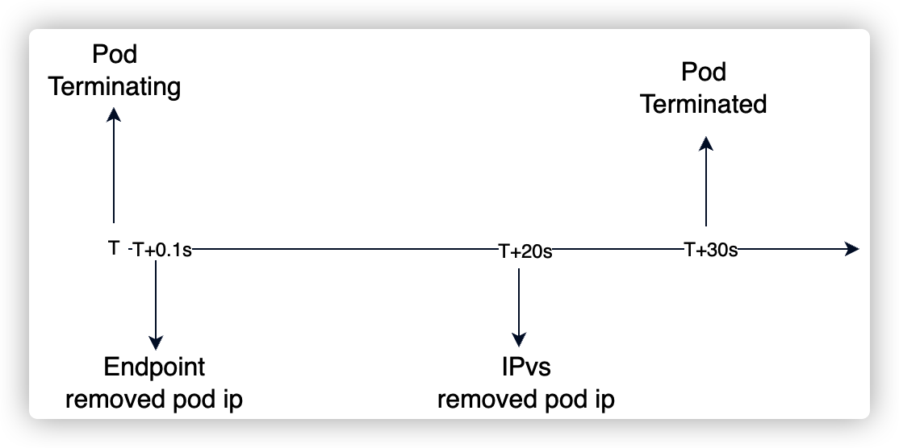

## 背景


最近业务应用使用 Service ip 进行压测时，当容器销毁时，部分请求会出现 connect refused 错误。按照文档 [云上 pod 下线引起短时服务不可用](/blog/p/service-cause-failure/) 进行优雅下线优化后有一定改善，但是仍然存在 connect refused 异常。本文通过分析 kube-router 实现 vip 的逻辑，进行定位问题根因，并举一反三对 kubernetes 默认组件 kube-proxy service IP 实现进行研究和分析。

## IPVS VIP 实现

ipvs (IP Virtual Server) 是工作在内核态的4层负载均衡，也就是我们常说的4层`LAN`交换，作为 Linux 内核的一部分。`ipvs`运行在主机上，在真实服务器集群前充当负载均衡器。`ipvs`可以将基于`TCP`和`UDP`的服务请求转发到真实服务器上，从而达到通过单个 VIP 代理多个后端真实服务的目的。IPVS 和 iptables 一样都是基于内核底层 netfilter 实现，netfilter 主要通过各个链的钩子实现包处理和转发。


ipvs 作为内核中负载均衡，有多种负载策略：rr（轮询）、wrr（加权轮询）、sh（源地址哈希）等，默认使用 rr 模式。vip 后面关联多个 pod ip， 通过 VIP 请求后 ipvs 会根据配置的均衡策略选取其中一个 pod ip 进行流量转发。


如上图，使用 ipvsadm 工具查看 10.59.38.148:8001 转发的 RS（Real Server） 有两个：10.60.10.7、10.60.14.8，转发策略为 RR，其中 Weight 标识每个 RS 的权重。

当 Weight=0 时，新连接不会转发到该 RS；但是，已建立的连接仍会保持，直到连接释放。ActiveConn 是活动连接数，也就是 tcp 连接状态的 ESTABLISHED；InActConn 是指除了 ESTABLISHED 以外的，所有的其它状态的 tcp 连接。

## 常用开源组件实现逻辑

### kube-router 

先已公司使用 cni 插件为 kube-router 作为研究对象，通过使用部署一个简单的 go http server 两副本应用，观察删除一个 Pod 后，会发生哪些变化：

 

上面两张图，分别对应 http server 在是否处理 SIGTERM 信号场景下对 ipvs 更新的影响。

上图可以，看出当删除 Pod 时，在 20s+ 以后 kube-router 才会将被删除的 pod IP 在 ipvs 中摘掉。而摘掉流量方式是直接在 ipvs 中删除对应的 RS (10.60.10.7)：

==》

这样，在两种场景下会出现异常：

1. pod 容器已完全删除，但是 ipvs 还会转发流量到被删除的 Pod IP 上。也就容器完全删除早于 ipvs 中 RS 的删除动作；
2. Ipvs 摘掉pod 流量时，存在未释放的连接。也就是 ipvs 中 RS 删除早于 pod 销毁，并且存在持久化的会话；

第一种问题还是未做好优雅下线导致的，可以通过 prestop 来增加优雅下线，提前将连接释放掉。但是，由于删除后 20s 仍然又新连接进来，虽然解决了第一个场景问题，但是第二个场景问题还是会存在的。

在上述业务压测出现问题的场景中：

1. 业务容器已经做了优雅下线（等待15s+业务层开始优雅下线逻辑），整个优雅下线时间>=15s；
2. 修改业务容器 terminatedGracePeriod 时长为 120s 后，我们抓包发现没有新流量进入，但仍然存在 connect refused 异常；

出现问题场景，属于第二种。那第二种问题如何解决呢？回答这个问题前，先要弄清楚下面疑问：

1. 首先，为什么 ipvs 在 20s 后才会将 pod ip 摘掉；
2. 之前有了解过 ipvs 中 RS weight=0 时，新流量不会转发到该 RS，那 kube-router 有没有实现这个逻辑呢？

带着上面两个问题，我们来看一下 kube-router 源码。

#### 源码分析

kube-router 内部会通过 list/watch 来监听 endpoint 和 service 更新，当 endpoint 发生变更（pod 删除）

```go
// proxy/network_services_controller.go
func (nsc *NetworkServicesController) OnEndpointsUpdate(ep *api.Endpoints) {
	... ...
	// build new service and endpoints map to reflect the change
	newServiceMap := nsc.buildServicesInfo()
	newEndpointsMap := nsc.buildEndpointsInfo()

	if len(newEndpointsMap) != len(nsc.endpointsMap) || !reflect.DeepEqual(newEndpointsMap, nsc.endpointsMap) {
		nsc.endpointsMap = newEndpointsMap
		nsc.serviceMap = newServiceMap
		glog.V(1).Infof("Syncing IPVS services sync for update to endpoint: %s/%s", ep.Namespace, ep.Name)
		nsc.sync(synctypeIpvs)
	} else {
		glog.V(1).Infof("Skipping IPVS services sync on endpoint: %s/%s update as nothing changed", ep.Namespace, ep.Name)
	}
}


// OnServiceUpdate handle change in service update from the API server
func (nsc *NetworkServicesController) OnServiceUpdate(svc *api.Service) {

	... ...
	// build new service and endpoints map to reflect the change
	newServiceMap := nsc.buildServicesInfo()
	newEndpointsMap := nsc.buildEndpointsInfo()

	if len(newServiceMap) != len(nsc.serviceMap) || !reflect.DeepEqual(newServiceMap, nsc.serviceMap) {
		nsc.endpointsMap = newEndpointsMap
		nsc.serviceMap = newServiceMap
		glog.V(1).Infof("Syncing IPVS services sync on update to service: %s/%s", svc.Namespace, svc.Name)
		nsc.sync(synctypeIpvs)
	} else {
		glog.V(1).Infof("Skipping syncing IPVS services for update to service: %s/%s as nothing changed", svc.Namespace, svc.Name)
	}
}
```

可以看到 endpoint 和 service 更新，都是先更新 nsc 的 endpointMap 和 serviceMap，然后执行 nsc.sync 函数。nsc.sync 函数将变更类型同步到 syncChan：

```go
//proxy/network_services_controller.go
func (nsc *NetworkServicesController) sync(syncType int) {
	select {
	case nsc.syncChan <- syncType:
	default:
		glog.V(2).Infof("Already pending sync, dropping request for type %d", syncType)
	}
}
```

syncChan 在 NetworkServiceController 的 Run 函数中进行监听：

```go
// Run periodically sync ipvs configuration to reflect desired state of services and endpoints
func (nsc *NetworkServicesController) Run(healthChan chan<- *healthcheck.ControllerHeartbeat, stopCh <-chan struct{}, wg *sync.WaitGroup) {
	......

	select {
	case <-stopCh:
		glog.Info("Shutting down network services controller")
		return
	default:
    // kube-router 默认启动时，先更新一遍 ipvs 
		err := nsc.doSync()
		if err != nil {
			glog.Fatalf("Failed to perform initial full sync %s", err.Error())
		}
		nsc.readyForUpdates = true
	}

	// loop forever until notified to stop on stopCh
	for {
		select {
		case <-stopCh:
			nsc.mu.Lock()
			nsc.readyForUpdates = false
			nsc.mu.Unlock()
			glog.Info("Shutting down network services controller")
			return

		case <-gracefulTicker.C:
			if nsc.readyForUpdates && nsc.gracefulTermination {
				glog.V(3).Info("Performing periodic graceful destination cleanup")
				nsc.gracefulSync()
			}

    // 从 syncChan 唤醒协程执行 ipvs 的更新/同步逻辑 
		case perform := <-nsc.syncChan:
			healthcheck.SendHeartBeat(healthChan, "NSC")
			switch perform {
			case synctypeAll:
				glog.V(1).Info("Performing requested full sync of services")
				err := nsc.doSync()
				if err != nil {
					glog.Errorf("Error during full sync in network service controller. Error: " + err.Error())
				}
			case synctypeIpvs:
				glog.V(1).Info("Performing requested sync of ipvs services")
				nsc.mu.Lock()
                //  ipvs 的更新/同步逻辑
				err := nsc.syncIpvsServices(nsc.serviceMap, nsc.endpointsMap)
				nsc.mu.Unlock()
				if err != nil {
					glog.Errorf("Error during ipvs sync in network service controller. Error: " + err.Error())
				}
			}
			if err == nil {
				healthcheck.SendHeartBeat(healthChan, "NSC")
			}

		case <-t.C:
			glog.V(1).Info("Performing periodic sync of ipvs services")
			healthcheck.SendHeartBeat(healthChan, "NSC")
			err := nsc.doSync()
			if err != nil {
				glog.Errorf("Error during periodic ipvs sync in network service controller. Error: " + err.Error())
				glog.Errorf("Skipping sending heartbeat from network service controller as periodic sync failed.")
			} else {
				healthcheck.SendHeartBeat(healthChan, "NSC")
			}
		}
	}
}
```

更新 ipvs 函数 nsc.syncIpvsServices ：

```go
// proxy/service_endpoints_sync.go
// sync the ipvs service and server details configured to reflect the desired state of Kubernetes services
// and endpoints as learned from services and endpoints information from the api server
func (nsc *NetworkServicesController) syncIpvsServices(serviceInfoMap serviceInfoMap, endpointsInfoMap endpointsInfoMap) error {
	start := time.Now()
	defer func() {
		endTime := time.Since(start)
		if nsc.MetricsEnabled {
			metrics.ControllerIpvsServicesSyncTime.Observe(endTime.Seconds())
		}
		glog.V(1).Infof("sync ipvs services took %v", endTime)
	}()

	var err error
	var syncErrors bool

	// map to track all active IPVS services and servers that are setup during sync of
	// cluster IP, nodeport and external IP services
	activeServiceEndpointMap := make(map[string][]string)

	// 配置 VIP ipvs
	err = nsc.setupClusterIPServices(serviceInfoMap, endpointsInfoMap, activeServiceEndpointMap)
	if err != nil {
		syncErrors = true
		glog.Errorf("Error setting up IPVS services for service cluster IP's: %s", err.Error())
	}
    
    // 配置 nodeport ipvs
	err = nsc.setupNodePortServices(serviceInfoMap, endpointsInfoMap, activeServiceEndpointMap)
	if err != nil {
		syncErrors = true
		glog.Errorf("Error setting up IPVS services for service nodeport's: %s", err.Error())
	}
	err = nsc.setupExternalIPServices(serviceInfoMap, endpointsInfoMap, activeServiceEndpointMap)
	if err != nil {
		syncErrors = true
		glog.Errorf("Error setting up IPVS services for service external IP's and load balancer IP's: %s", err.Error())
	}
 
    // 清理过期 vip
	err = nsc.cleanupStaleVIPs(activeServiceEndpointMap)
	if err != nil {
		syncErrors = true
		glog.Errorf("Error cleaning up stale VIP's configured on the dummy interface: %s", err.Error())
	}
    
    // 清理过期 RS IP
	err = nsc.cleanupStaleIPVSConfig(activeServiceEndpointMap)
	if err != nil {
		syncErrors = true
		glog.Errorf("Error cleaning up stale IPVS services and servers: %s", err.Error())
	}
	err = nsc.syncIpvsFirewall()
	if err != nil {
		syncErrors = true
		glog.Errorf("Error syncing ipvs svc iptables rules to permit traffic to service VIP's: %s", err.Error())
	}
	err = nsc.setupForDSR(serviceInfoMap)
	if err != nil {
		syncErrors = true
		glog.Errorf("Error setting up necessary policy based routing configuration needed for direct server return: %s", err.Error())
	}

	if syncErrors {
		glog.V(1).Info("One or more errors encountered during sync of IPVS services and servers to desired state")
	} else {
		glog.V(1).Info("IPVS servers and services are synced to desired state")
	}

	return nil
}
```

每次有 endpoint/service 发生变化，nsc.syncIpvsServices 都会将所有ipvs 更新一遍，整个函数执行时间根据 service 数量不同执行时间不同。在我们线下环境有 3200 个 service，函数执行时间 30s+。


这就解答了「为什么 ipvs 在 20s 后才会将 pod ip 摘掉」。

那上面说的设置 ipvs rs weight 来停止新连接的转发，在 kube-router 中有没有实现呢？我们在阅读源码时，发现下面这一部分代码：

```go
// Run periodically sync ipvs configuration to reflect desired state of services and endpoints
func (nsc *NetworkServicesController) Run(healthChan chan<- *healthcheck.ControllerHeartbeat, stopCh <-chan struct{}, wg *sync.WaitGroup) {
	......

	// loop forever until notified to stop on stopCh
	for {
		select {
		case <-stopCh:
			nsc.mu.Lock()
			nsc.readyForUpdates = false
			nsc.mu.Unlock()
			glog.Info("Shutting down network services controller")
			return

		case <-gracefulTicker.C:
			if nsc.readyForUpdates && nsc.gracefulTermination {
				glog.V(3).Info("Performing periodic graceful destination cleanup")
				nsc.gracefulSync()
			}
       ......
}
```

NSC 中存在一个 graceful 定时器，触发时会执行  nsc.gracefulSync 函数：

```go
// proxy/network_service_graceful.go
func (nsc *NetworkServicesController) gracefulSync() {
	nsc.gracefulQueue.mu.Lock()
	defer nsc.gracefulQueue.mu.Unlock()
	var newQueue []gracefulRequest
	// Itterate over our queued destination removals one by one, and don't add them back to the queue if they were processed
	for _, job := range nsc.gracefulQueue.queue {
		if removed := nsc.gracefulDeleteIpvsDestination(job); removed {
			continue
		}
		newQueue = append(newQueue, job)
	}
	nsc.gracefulQueue.queue = newQueue
}

func (nsc *NetworkServicesController) gracefulDeleteIpvsDestination(req gracefulRequest) bool {
	var deleteDestination bool
	// Get active and inactive connections for the destination
	aConn, iConn, err := nsc.getIpvsDestinationConnStats(req.ipvsSvc, req.ipvsDst)
	if err != nil {
		glog.V(1).Infof("Could not get connection stats for destination: %s", err.Error())
	} else {
		// Do we have active or inactive connections to this destination
		// if we don't, proceed and delete the destination ahead of graceful period
		if aConn == 0 && iConn == 0 {
			deleteDestination = true
		}
	}

	// Check if our destinations graceful termination period has passed
	if time.Since(req.deletionTime) > req.gracefulTerminationPeriod {
		deleteDestination = true
	}

	//Destination has has one or more conditions for deletion
	if deleteDestination {
		glog.V(2).Infof("Deleting IPVS destination: %s", ipvsDestinationString(req.ipvsDst))
		if err := nsc.ln.ipvsDelDestination(req.ipvsSvc, req.ipvsDst); err != nil {
			glog.Errorf("Failed to delete IPVS destination: %s, %s", ipvsDestinationString(req.ipvsDst), err.Error())
		}
	}
	return deleteDestination
}
```

nsc.gracefulSync 函数主要逻辑是对 ipvs 中 RS 进行删除，判断逻辑如下：

1. InActConn 和 ActConn 都为0，则说明没有连接存在，可以直接删除；
2. 如果 InActConn 或 ActConn 不为零，但是 pod 删除等待时长已经超过 pod.gracefulTerminationPeriod，则可以直接删除；
3. 否则，等待下一次进行；

那 nsc.gracefulQueue 队列是在哪里写入的呢？我们之间检索 gracefulQueue 字段，发现在函数 nsc.ipvsDeleteDestination 中写入

```go
// proxy/network_service_graceful.go
func (nsc *NetworkServicesController) ipvsDeleteDestination(svc *ipvs.Service, dst *ipvs.Destination) error {
	// If we have enabled graceful termination set the weight of the destination to 0
	// then add it to the queue for graceful termination
	if nsc.gracefulTermination {
		req := gracefulRequest{
			ipvsSvc:      svc,
			ipvsDst:      dst,
			deletionTime: time.Now(),
		}
		dst.Weight = 0
		err := nsc.ln.ipvsUpdateDestination(svc, dst)
		if err != nil {
			return err
		}
		nsc.addToGracefulQueue(&req)
	} else {
		err := nsc.ln.ipvsDelDestination(svc, dst)
		if err != nil {
			return err
		}
	}
	// flush conntrack when Destination for a UDP service changes
	if svc.Protocol == syscall.IPPROTO_UDP {
		if err := nsc.flushConntrackUDP(svc); err != nil {
			glog.Errorf("Failed to flush conntrack: %s", err.Error())
		}
	}
	return nil
}
```

nsc.ipvsDeleteDestination 判断 nsc.gracefulTermination 如果开启，则不会立即删除。而是，执行下面操作：

1. 更新 ipvs 配置，设置 RS weight=0；
2. 加入 gracefulQueue 队列中，等待删除；

综上，可以看出 nsc.gracefulTermination 就是开启 ipvs 优雅下线的开关，而这个是通过参数 --ipvs-graceful-termination 来控制的。然后，我们开启 ipvs-graceful-termination 进行测试。

我们对测试应用 http-server 增加优雅下线逻辑：

1. 捕获 SIGTERM 信号；
2. 捕获到 SIGTERM 信号后，在 http header 中增加 connection: close，也就是在容器下线阶段使用短连接；

然后再进行压测：

=>=>

=>

上面分别对应，销毁 Pod 前、销毁 Pod 过程中1、销毁 Pod 过程中2、Pod 被完全销毁。


通过开启 ipvs graceful terminated，并且容器销毁后应用捕获 SIGTERM 信号进行连接的优雅下线，测试中未出现请求错误的问题。

#### 总结

对以上源码研究，进行总结如下：

1. kube-router 每次更新都是全量更新，service 数量不同 ipvs RS 新增、更新、删除的延迟不同；
2. 具有优雅删除 RS 的能力，并且结合了 Pod terminatedGracefulPeriod 进行 RS 的完全删除；
3. 为开启 --ipvs-graceful-termination，会立即删除 RS，但是由于全量更新的延迟，表现上是有一定延迟（线下 30s+、线上15s+）；

### kube-proxy 实现逻辑

根据 1.22 版本 kube-proxy 代码，pod 删除过程：


1. 销毁 Pod，Endpoint 中移除销毁中的 Pod IP；
2. kube-proxy watch 到 endpoint 发生变化，进入 ipvs 删除判断逻辑：
   1. 协议不是 UDP 或 SFTP；
   2. ActConn 和 InActConn 都为0；
3. 不满足删除判断，则更新 ipvs 中 RS weight=0;
4. 然后，将 RS 加入到本地队列，每隔 1min 进行删除判断；

#### 源码

```go
// proxy/ipvs/graceful_termination.go

// GracefulDeleteRS to update rs weight to 0, and add rs to graceful terminate list
func (m *GracefulTerminationManager) GracefulDeleteRS(vs *utilipvs.VirtualServer, rs *utilipvs.RealServer) error {
	// Try to delete rs before add it to graceful delete list
	ele := &listItem{
		VirtualServer: vs,
		RealServer:    rs,
	}
	deleted, err := m.deleteRsFunc(ele)
	if err != nil {
		klog.Errorf("Delete rs %q err: %v", ele.String(), err)
	}
	if deleted {
		return nil
	}
	rs.Weight = 0
	err = m.ipvs.UpdateRealServer(vs, rs)
	if err != nil {
		return err
	}
	klog.V(5).Infof("Adding an element to graceful delete rsList: %+v", ele)
	m.rsList.add(ele)
	return nil
}

func (m *GracefulTerminationManager) deleteRsFunc(rsToDelete *listItem) (bool, error) {
	klog.V(5).Infof("Trying to delete rs: %s", rsToDelete.String())
	rss, err := m.ipvs.GetRealServers(rsToDelete.VirtualServer)
	if err != nil {
		return false, err
	}
	for _, rs := range rss {
		if rsToDelete.RealServer.Equal(rs) {
			// For UDP and SCTP traffic, no graceful termination, we immediately delete the RS
			//     (existing connections will be deleted on the next packet because sysctlExpireNoDestConn=1)
			// For other protocols, don't delete until all connections have expired)
			if utilipvs.IsRsGracefulTerminationNeeded(rsToDelete.VirtualServer.Protocol) && rs.ActiveConn+rs.InactiveConn != 0 {
				klog.V(5).Infof("Not deleting, RS %v: %v ActiveConn, %v InactiveConn", rsToDelete.String(), rs.ActiveConn, rs.InactiveConn)
				return false, nil
			}
			klog.V(5).Infof("Deleting rs: %s", rsToDelete.String())
			err := m.ipvs.DeleteRealServer(rsToDelete.VirtualServer, rs)
			if err != nil {
				return false, fmt.Errorf("Delete destination %q err: %v", rs.String(), err)
			}
			return true, nil
		}
	}
	return true, fmt.Errorf("Failed to delete rs %q, can't find the real server", rsToDelete.String())
}
```

kube-proxy GracefulDeleteRS 函数会 deleteRsFunc 进行 RS 删除，删除 RS 条件：

1. 协议不是 UDP 或 SFTP；
2. ActConn 和 InActConn 都为0；

否则，更新 ipvs 将 RS weight 置为 0，不接收新流量进入。然后会加入到带删除列表中，进行定期（间隔1min）清理：

```go
func (m *GracefulTerminationManager) tryDeleteRs() {
	if !m.rsList.flushList(m.deleteRsFunc) {
		klog.Errorf("Try flush graceful termination list err")
	}
}

// Run start a goroutine to try to delete rs in the graceful delete rsList with an interval 1 minute
func (m *GracefulTerminationManager) Run() {
	go wait.Until(m.tryDeleteRs, rsCheckDeleteInterval, wait.NeverStop)
}
```

## 优化方案

|        |                                                   | 优点 | 缺点 |
| :----- | :------------------------------------------------ | :--- | :--- |
| 方案一 | kube-router 开启 --ipvs-graceful-termination 参数 |      |      |
| 方案二 | 开发内网负载均衡组件                              |      |      |


## 参考

1. http://www.dockone.io/article/9441
2. https://wsgzao.github.io/post/lvs-nat/
3. [Issue 572 - Graceful termination](https://github.com/cloudnativelabs/kube-router/pull/706)
4. [kube-proxy ipvs support graceful termination](https://github.com/kubernetes/kubernetes/pull/66012)
