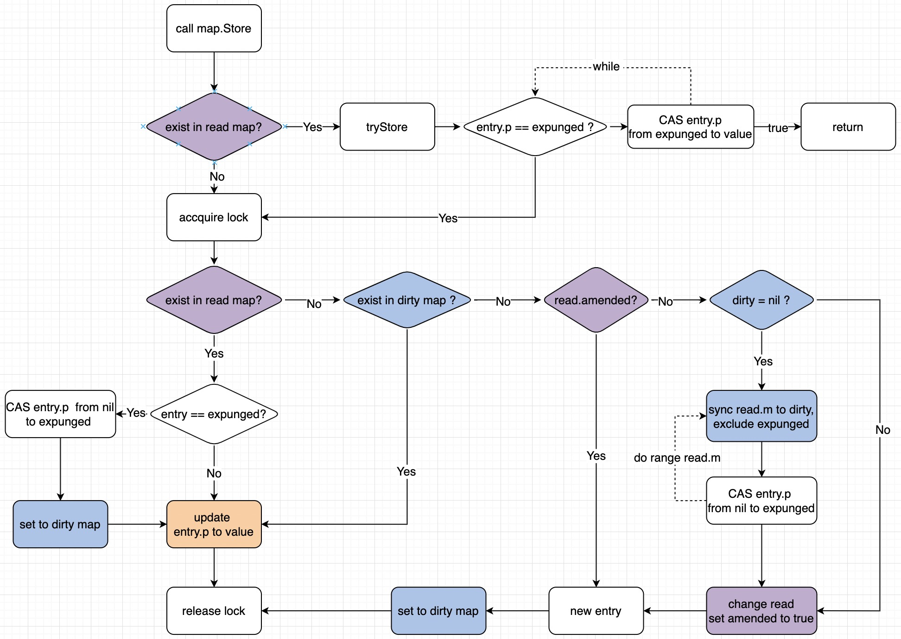
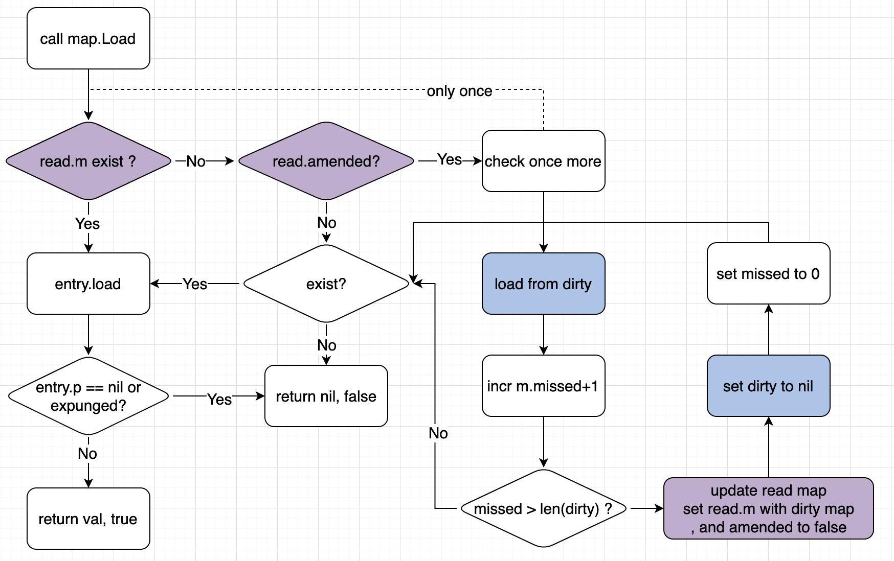
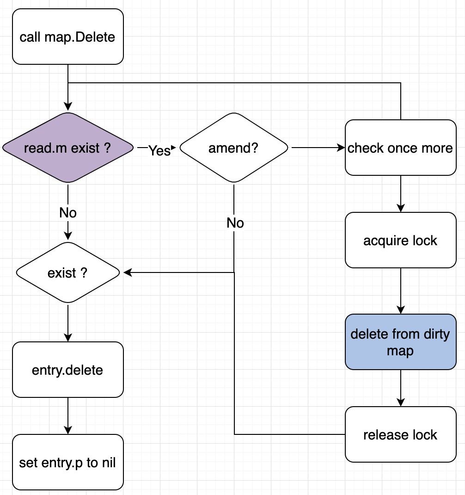
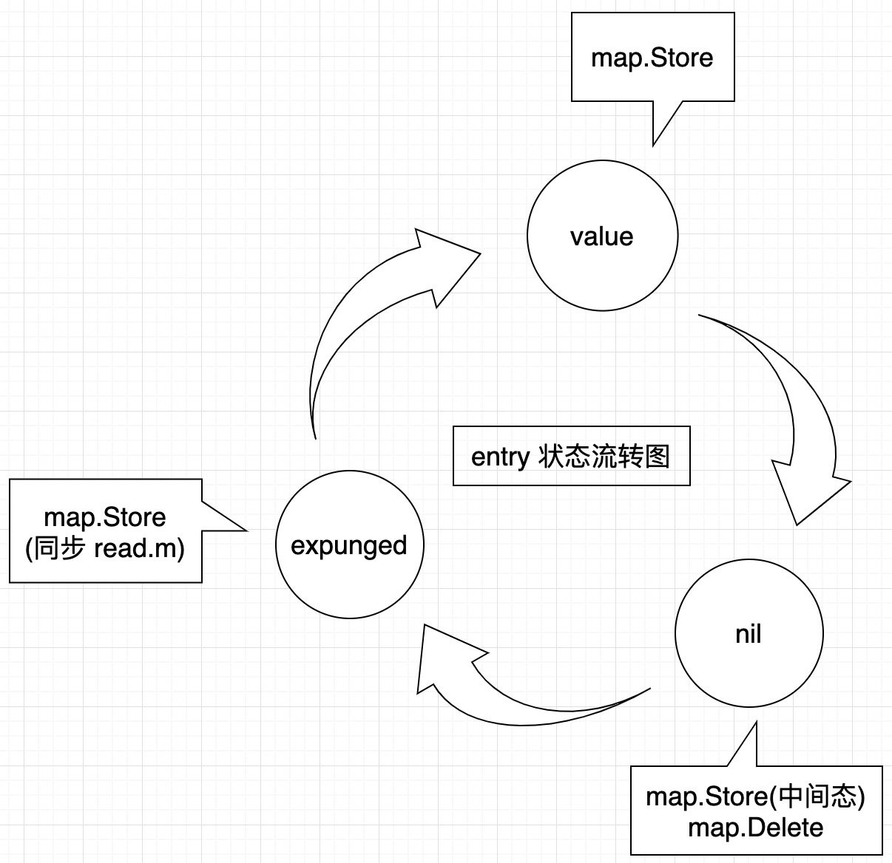

## 背景

最近看到了一个文章[1]，其中提到了 sync.map 的一个bug，key 如果使用连接，会导致连接泄漏。文中提到了具体原因是 sync.map 对 key 删除是软删除，只是将 可以对应的 value 置为 nil，key 还会继续存在。

根据文章中描述，发现自己对 sync.Map 了解不够透彻，所以就打算进行一番了解。sync.Map 是 go 标准库中实现的线程安全的 Map，主要适用的场景：

>>The Map type is optimized for two common use cases: 
(1) when the entry for a given key is only ever written once but read many times, as in caches that only grow, or 
(2) when multiple goroutines read, write, and overwrite entries for disjoint sets of keys. In these two cases, use of a Map may significantly reduce lock contention compared to a Go map paired with a separate Mutex or RWMutex.


1. 同一个 key 读多写少；
2. 并发读、写、覆盖不同 key；

其中，sync.Map 包中提到，在这两种场景中性能要优于使用 Map + Mutex。接下来我们看一下如何实现的，为什么在这两种场景下性能有优势。

## 源码分析


### 数据结构

```
type Map struct {
    mu Mutex

    // 只读区，保存部分健值对
    // 修改时进行原子性替换
    read atomic.Value

    // 新写入的健值对，先保存到 dirty 中
    // 更新或者被删除的，dirty 中不会存储 expunged 健值对
    dirty map[interface{}]*entry

    // 记录 Load 出现多少次在 dirty 中读取健值对情况。
    misses int
}

// 存储 value 的指针
// key 被删除时通过 CAS 修改为 nil 或 expunged
type entry struct {
    p unsafe.Pointer // *interface{}
}

type readOnly struct {
    // 存储的部分健值对，只会 m 中元素
    // 不会存在并发读写情况。
    m       map[interface{}]*entry

    // dirty 中是否有 read.m 中不存在的健值对
    amended bool // true if the dirty map contains some key not in m.
}
```

sync.Map 中使用了两个 map 对象来尽量避免锁竞争，相当于增加一个缓冲。其中 read map 中记录部分健值对，dirty 中保存新写入的 value 和 read.m 中未被标记为 expunged 或 nil 的 entry。

### 接口分析



#### Store 逻辑：

1. 判断 read.m 中是否存在key。
    * 如果存在进行尝试更新，会起一个循环不停尝试 CAS 更新，更新成功则返回。
    * 如果read.m 中不存在 key，或者更新过程中发现 key 对应 entry 已被标记为 expunged，则进行第二步；
    * 可以看出如果更新某个 key (已经在 read.m 中，并且未被删除) ，更新并不会加锁
2. 加锁，再次判断 read.m 中是否存在
    * 如果存在，然后判断之前 entry 是否为 expunged 状态，如果是（说明 dirty 中不存在 key），则把 key-entry 写入 dirty map 中；然后，原子更新 entry.p 指针。
    * 否则进行第三步
3. dirty map 中是否存在 key，如果存在，则直接原子更新 entry.p 指针；否则，进行第四步；
4. read 和 dirty 中都不存在目标 key，则添加到 dirty 中。添加会做一些数据同步操作：
    * 如果 read.m 不需要进行修正（ read.amended = false），则同步 read.m 中为被删除（enty.p!=nil or expunged）健值对到 dirty map 中。并通过 CAS 操作更新read.m 中被删除的 entry（enty.p = nil）标记为 expunged。
    * 否则，直接添加到 dirty 中。


#### Load 逻辑



1. read.m 中是否存在，如果存在，判断是否已被删除，并返回相应状态；否则，进行下一步；
2. 判断 read.amended 状态：
    * 如果需要修正，进行加锁，然后再一次判断 read.m 和 read.amended，避免并发过程中 read 出现更新；
    * 获取 dirty 中 key，并更新 miss 次数；如果 miss 次数达到 dirty.length，则更新read，并置 dirty=nil;
    * 释放锁；
3. 判断是否存在 key，或者是否被删除，进行相应返回


#### Delete 逻辑



删除和 Load key 逻辑类似。

1. 首先，判断 read 中是否存在，如果存在，则标记 entry.p 为nil；如果不存在，继续判断 amended ；
2. 加锁，进行二次判断，然后调用 delete 删除 dirty map 中 key；释放锁；


## 总结

1. read.m 中存在的 key 并非读写不会加锁，进行原子更新；所以，对于同一个 key 进行读写，具有较优的性能；
2. 写入时，优先写入 dirty map，对于其他已经存在于 read.m 中的 key 读写并没有性能影响；


通过上面写入、删除、获取逻辑，可以看出：

1. key 大部分是软删除，即标记 entry.p 为 nil 或 expunged。只有在`删除->新增->读取->(missed > dirty.length)->修正read.m`情况会通过 GC 自动删除 key。
2. read.amended 标示存在某些 key 只存在 dirty 中；
3. read.m 更新是在 missed 次数达到阈值（dirty.length）时，直接进行原子覆盖。
    * 为什么不 miss 一次进行一次更新？
4. dirty 为 nil 情况：未被使用的 map；miss 超过阈值时；
5. 持有锁情况：修改 dirty、修正 read；
6. 看代码时对 store 中判断，`entry.unexpungeLocked` 时对 dirty 才写入 key。对这个逻辑有个疑问，为什么 entry 为 expunged 状态说明 dirty 不为 nil ，并且其中不存在该 key 呢？
    * 通过下图能够看到，enrty 只有 read.m 与 dirty 同步逻辑中才会修改为 expunged; 并且同步过程不会同步被删除的 key；所以，expunged 状态的 key 不会存在于 dirty 中。
    * 如5，dirty map 为 nil 只有两种情况，所以只有修正read 情况。因为 read.m 中包含 key，所以并没有进行原子更新 read。这样，就会出现 dirty =nil 情况；
7. dirty 中不会包含 expunged 状态的 entry，并且包含所有有效 key；



## reference 

1. [sync.Map 引起的 bug](https://purewhite.io/2020/08/24/golang-sync-map-keys-never-delete/)
2. [如何实现一个线程安全的map](https://halfrost.com/go_map_chapter_one/)

