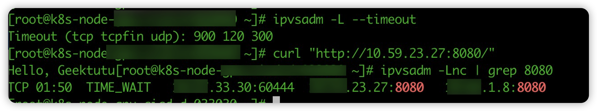

## 背景

近日，收到业务同学反馈，在进行在线推理业务时发现：部署到 Kubernetes 的服务，压测试性能出现数量级下降问题（只能达到 200 QPS），业务性能将难以满足客户实际需求。


我们对该问题进行了详细分析，通过对内核参数优化，最终容器环境性能可以达到 2000 QPS。

下面，我们将会分享整个问题分析和优化的过程，并且对其中涉及到的部分关键性问题进行剖析。另外，为何 kubernetes 优化后最高达到  2000 qps，而 docker run 环境能够达到 4000 qps？下文中也会给出答案。

## 分析过程

根据业务同学反馈，压测端（10.58.14.13）使用 kubernetes service 和 nodeport 两种方式，都会出现 QPS 急剧降低的问题。

观察 QPS 降低为 200 时 ab 压测输出结果，可以看出 rt 大部分消耗在 connect  阶段（最大达到1s），也就是压测机（10.58.14.13）和 10.58.14.15 上的 Kubernetes 容器建立连接的过程：


出现这种现象，可以从下面两个方面进行分析：

1. 14.13 -> 14.15 之间网络存在问题；
2. 14.15 系统层面问题；

为了排除网络方面的问题，我们在 14.15 主机上使用 Pod IP 进行压测，压测 QPS 为 2000 左右。然后，同样在 14.15 主机上使用 service ip 进行压测，我们发现在大约 30000 请求后，和之前业务同学描述一致：QPS 由 2000 降低到不到 120。压测时观察系统负载和业务容器 cpu 都非常低，这说明问题和 Kubernetes 网络架构有关。先看一下使用 Kubernetes service 请求和 Pod ip 两种方式有哪些不同：


Service ip 是 Kubernetes 在 IP 池中选取的一个 VIP，每个 VIP 会关联多个 POD 实例。为了能够通过 VIP 请求到具体的容器，Kubernetes 网络插件会在每个节点上做一些处理，目前常用的两种模式是 iptables 或 ipvs。我们本次出问题场景使用的是 ipvs 模式。在 ipvs 模式下，当客户端使用 VIP 请求时，会经过内核 ipvs 模块进行数据处理，才将流量转发到具体的容器实例。

通过对比发现，我们本次出现问题应该就是 ipvs 模块上。

为了方便排查问题，我们在 Kubernetes 中部署了一个简单的 http server Pod，然后在 Pod 所在主机上进行压测来进行问题分析。

在 linux 系统中有很多工具可以方便我们来查看 ipvs 管理的连接，在压测过程中使用 ipvsadm 观察看到 vip 关联的 rs 后端连接数的变化：


这里简单介绍执行 ipvsadm - L -t vip:port 返回的信息中几个字段的含义：

1. Weight 流量转发给某个后端实例所占的权重，当该值为 0 时新连接就不会转发到对应的后端 ip 上；
2. ActionConn 是活动连接数，也就是tcp连接状态的 ESTABLISHED；
3. InActConn 是指除了ESTABLISHED以外的,所有的其它状态的tcp连接；

我们在压测开始 server cpu 利用能够跑满，随着 InActConn 数量的增长 server 的 cpu 利用率也开始下滑，最后当 InActConn 维持到 32000 多时，http server 的 cpu 利用率只有 3%，InActConn 数数字几乎没有变化。显然，大部分请求没有到应用层。


之前在 Kubernetes 社区看到过一个关于 ipvs issue [#81775](https://github.com/kubernetes/kubernetes/issues/81775)，主要是讲一个单个客户端向某个 vip 发送请求时，容器销毁过程中会出现大量的请求错误。其中提到了一个关于 ipvs 内核参数 net.ipv4.vs.conn_reuse_mode，该参数用来开启对 ipvs connect 端口重用：

```
conn_reuse_mode - INTEGER
    1 - default
 
    Controls how ipvs will deal with connections that are detected
    port reuse. It is a bitmap, with the values being:
 
    0: disable any special handling on port reuse. The new
    connection will be delivered to the same real server that was
    servicing the previous connection. This will effectively
    disable expire_nodest_conn.
 
    bit 1: enable rescheduling of new connections when it is safe.
    That is, whenever expire_nodest_conn and for TCP sockets, when
    the connection is in TIME_WAIT state (which is only possible if
    you use NAT mode).
 
    bit 2: it is bit 1 plus, for TCP connections, when connections
    are in FIN_WAIT state, as this is the last state seen by load
    balancer in Direct Routing mode. This bit helps on adding new
    real servers to a very busy cluster.
```

- net.ipv4.vs.conn_reuse_mode=0时，ipvs不会对新连接进行重新负载，而是复用之前的负载结果，将新连接转发到原来的rs上；
- net.ipv4.vs.conn_reuse_mode=1时，ipvs则会对新连接进行重新调度。

查看压测的节点内核参数，发现 net.ipv4.vs.conn_reuse_mode 值为 1。然后，我们修改内核参数： net.ipv4.vs.conn_reuse_mode=0，再进行压测，QPS 稳定到了 2000 左右。说明问题就是和 ipvs 这个参数有关。

相关的，还有一个内核参数`net.ipv4.vs.expire_nodest_conn`，用于控制连接的rs不可用时的处理。在开启时，如果后端rs不可用，会立即结束掉该连接，使客户端重新发起新的连接请求；否则将数据包**silently drop**，也就是DROP掉数据包但不结束连接，等待客户端的重试。内核中关于**destination 不可用**的判断，是在ipvs执行删除`vs`（在`__ip_vs_del_service()`中实现）或删除`rs`（在`ip_vs_del_dest()`中实现）时，会调用`__ip_vs_unlink_dest()`方法，将相应的destination置为不可用。

## 进一步深挖

虽然，修改内核后 QPS 由 120+ 提升到 2000 已经满足业务方的要求。但是还有一些疑惑没有解决：

1. 为什么内核参数设置为 net.ipv4.vs.conn_reuse_mode=1 时，导致 QPS 降低到了 200？
2. 内核参数修改为 net.ipv4.vs.conn_reuse_mode=0 时，会导致哪些问题？
3. 为什么 docker run 运行的容器 QPS 能达到 4000 ？

带着这些疑惑，我们做进一步研究。

### net.ipv4.vs.conn_reuse_mode 开启和关闭影响

ipvs 会将请求 vs 的请求转发到 rs 需要使用 conntrack 表记录每一个连接的四元组信息。在我们压测过程中也可以看到每一条连接都会对应一条记录：


第一个问题，社区 2018 年在 [#70747](https://github.com/kubernetes/kubernetes/issues/70747) issue 中进行了讨论和修复。其中 comment 中有提到一个 [linux kernel 的讨论](https://marc.info/?l=linux-virtual-server&m=151706660530133&w=2)。在未开启端口复用时，如果匹配到新请求四元组已经存在于 conntrack 表中，会直接将包丢弃（NF_DROP）：

```
// net/netfilter/ipvs/ip_vs_core.c
static unsigned int
ip_vs_in(struct netns_ipvs *ipvs, unsigned int hooknum, struct sk_buff *skb, int af)
{
... ....
/*
* Check if the packet belongs to an existing connection entry
*/
cp = pp->conn_in_get(ipvs, af, skb, &iph);  //判断是否属于某个已有的connection
conn_reuse_mode = sysctl_conn_reuse_mode(ipvs);
 
//当conn_reuse_mode开启，同时出现端口复用（例如收到TCP的SYN包，并且也属于已有的 connection），进行处理
if (conn_reuse_mode && !iph.fragoffs && is_new_conn(skb, &iph) && cp) {
    bool uses_ct = false, resched = false;

    //如果开启了expire_nodest_conn、目标rs的weight为0
    if (unlikely(sysctl_expire_nodest_conn(ipvs)) && cp->dest &&
       unlikely(!atomic_read(&cp->dest->weight))) {
        resched = true;

        //查询是否用到了conntrack
        uses_ct = ip_vs_conn_uses_conntrack(cp, skb);
    } else if (is_new_conn_expected(cp, conn_reuse_mode)) {
        //连接是 expected 的情况，比如 FTP
        uses_ct = ip_vs_conn_uses_conntrack(cp, skb);
        if (!atomic_read(&cp->n_control)) {
        		resched = true;
        } else {
            /* Do not reschedule controlling connection
            * that uses conntrack while it is still
            * referenced by controlled connection(s).
            */
            resched = !uses_ct;
        }
    }
 
    //如果expire_nodest_conn未开启，并且也非期望连接，实际上直接跳出了
    if (resched) {
        if (!atomic_read(&cp->n_control))
            ip_vs_conn_expire_now(cp);
            __ip_vs_conn_put(cp);
            //当开启了net.ipv4.vs.conntrack，SYN数据包会直接丢弃，等待客户端重新发送SYN
            if (uses_ct)
            		return NF_DROP;
            //未开启conntrack时，会进入下面ip_vs_try_to_schedule的流程
            cp = NULL;
        }
    }
 
.... ...
}
```

TCP 请求发送第一个 SYN 包被丢弃后，需要等待一个 MSL （60s），客户端会重新发送 SYN。在高并发情况，由于会大量新建连接，会导致出现较多的端口重用情况，就导致连接等待 >=1s 进行重新发送握手包。所以，在上面的压测图中可以看到，connect 阶段最大会达到几秒钟。kubernetes 在1.13 版本开始，对该问题进行了优化，kube-proxy 默认会修改内核参数  net.ipv4.vs.conn_reuse_mode=0 。


既然从 1.13 开始修改了默认参数，为什么我们的测试环境为 net.ipv4.vs.conn_reuse_mode=1 呢？先看一下，我们出现问题的环境 kubernetes 版本为 1.19.12，os 3.10.0。然后，我们对 1.19.12 k8s 代码进行 review 发现：

```go
connReuseMinSupportedKernelVersion = "4.1"
... ...
if kernelVersion.LessThan(version.MustParseGeneric(connReuseMinSupportedKernelVersion)) {
    klog.Errorf("can't set sysctl %s, kernel version must be at least %s", sysctlConnReuse, connReuseMinSupportedKernelVersion)
} else {
    // Set the connection reuse mode
    if err := utilproxy.EnsureSysctl(sysctl, sysctlConnReuse, 0); err != nil {
        return nil, err
    }
}
... ...
```

在 [pr#82066](https://github.com/kubernetes/kubernetes/pull/82066) 中提到，由于出现 3.10 版本内核中部署 kube-proxy 开启 ipvs 模式后无法启动。社区增加了内核版本的 check，1.19.0 开始如果内核版本 <4.1 则不会修改 net.ipv4.vs.conn_reuse_mode 内核参数。

另外，上面 issue 中也提到了，主要影响是在大量短连接时会出现端口重用的情况。那如果我们将业务架构改成长连接是否就可以达到一样的效果呢？


我们后端部署一个简单的 http server 进行压测可以发现，使用长连接的服务即便关闭端口复用 QPS 明显好与优化内核的场景。

第二个问题，开启 net.ipv4.vs.conn_reuse_mode 参数后，端口重用导致的问题。我们在上文中提到过社区的一个 issue [#81775](https://github.com/kubernetes/kubernetes/issues/81775)。当开启端口重用，单个客户端使用 vip 发送大量请求，如果某个 pod 销毁会出现 no route to host 报错。

```
08:50:10 E http_client.go:558> Unable to connect to 10.86.6.96:80 : dial tcp 10.86.6.96:80: connect: no route to host 08:50:11 E http_client.go:558> Unable to connect to 10.86.6.96:80 : dial tcp 10.86.6.96:80: connect: no route to host 08:50:12 E http_client.go:558> Unable to connect to 10.86.6.96:80 : dial tcp 10.86.6.96:80: connect: no route to host 08:50:13 E http_client.go:558> Unable to connect to 10.86.6.96:80 : dial tcp 10.86.6.96:80: connect: no route to host
```

issue 中进行了大量讨论，我在这里只简单分析一下出现该问题的原因。

在 Kubernetes 1.13 之前，kube-proxy ipvs 模式并不支持优雅删除，当 Endpoint 被删除时，kube-proxy 会直接移除掉 ipvs 中对应的 rs，这样会导致后续的数据包被丢掉。

在 1.13 版本后，Kubernetes 添加了**IPVS 优雅删除**的逻辑：

- 当 Pod 被删除时，kube-proxy 会先将 rs 的`weight`置为 0，以防止新连接的请求发送到此 rs，由于不再直接删除 rs，旧连接仍能与 rs 正常通信；
- 当 rs 的`ActiveConn `数量为 0（现在已改为`ActiveConn+InactiveConn==0`)，即不再有连接转发到此 rs 时，此 rs 才会真正被移除。

上面有提过 InactiveConn 是处于 TIME_WAIT 的连接，那每个处于 InactiveConn 的连接多久会过期呢，默认是120s，通过 ipvsadm -L --timeout 可以看到默认值：



正常情况 120s 就将连接在 conntrack 表中删除。但当开启端口重用后，权重修改为 0 的 rs 如果再次被复用，对于端口复用的连接，ipvs 不会主动进行新的调度（调用`ip_vs_try_to_schedule`方法）；同时，只是将`weight`置为 0，也并不会触发由`expire_nodest_conn `控制的结束连接或 DROP 操作，就这样，新连接的数据包当做什么都没发生一样，发送给了正在删除的 Pod。而这样的一个连接被 ipvs 认为是新的请求，会重置 ipvs timer，也就是说对应的这一个连接需要重新等待 120s 才会被删除。上面提到过，kube-proxy 在 ActiveConn+InactiveConn==0 时才会删除 rs，这样一来，只要不断的有端口复用的连接请求发来，rs 就不会被 kube-proxy 删除，上面提到的优雅删除是无法实现。

当后端应用进程退出后，后面端口复用的请求，会发送到已经被完全删除的容器 ip 上，就会出现上面的 connect: no route to host 报错。并且这个报错根据 ipvs 另一个参数配置有关：

```c
static unsigned int
ip_vs_in(struct netns_ipvs *ipvs, unsigned int hooknum, struct sk_buff *skb, int af)
{
... ....
/*
 * Check if the packet belongs to an existing connection entry
 */
cp = pp->conn_in_get(ipvs, af, skb, &iph);  //判断是否属于某个已有的connection
 
conn_reuse_mode = sysctl_conn_reuse_mode(ipvs);
 
//当conn_reuse_mode开启，同时出现端口复用（例如收到TCP的SYN包，并且也属于已有的 connection），进行处理
if (conn_reuse_mode && !iph.fragoffs && is_new_conn(skb, &iph) && cp) {
 bool uses_ct = false, resched = false;
 
 //如果开启了expire_nodest_conn、目标rs的weight为0
 if (unlikely(sysctl_expire_nodest_conn(ipvs)) && cp->dest &&
     unlikely(!atomic_read(&cp->dest->weight))) {
  resched = true;
   
  //查询是否用到了conntrack
  uses_ct = ip_vs_conn_uses_conntrack(cp, skb);
 } else if (is_new_conn_expected(cp, conn_reuse_mode)) {
 //连接是expected的情况，比如FTP
  uses_ct = ip_vs_conn_uses_conntrack(cp, skb);
    if (!atomic_read(&cp->n_control)) {
   resched = true;
  } else {
   /* Do not reschedule controlling connection
    * that uses conntrack while it is still
    * referenced by controlled connection(s).
    */
   resched = !uses_ct;
  }
 }
 
 //如果expire_nodest_conn未开启，并且也非期望连接，实际上直接跳出了
 if (resched) {
  if (!atomic_read(&cp->n_control))
   ip_vs_conn_expire_now(cp);
  __ip_vs_conn_put(cp);
  //当开启了net.ipv4.vs.conntrack，SYN数据包会直接丢弃，等待客户端重新发送SYN
  if (uses_ct)
   return NF_DROP;
  //未开启conntrack时，会进入下面ip_vs_try_to_schedule的流程
  cp = NULL;
 }
}
 
.... ...
}
```

- ```
  expire_nodest_conn=0 时，当后端 rs 不可达时，ipvs 会直接将数据包丢弃；
  ```

- expire_nodest_conn=1 时，当后端 rs 不可达，立即会返回一个报错给客户端。

针对这个问题，只在 kubernetes 上并不能完美的解决，例如：kube-router 中增加了优雅下线，会等待 Pod 配置的 TerminationGracePeriodSeconds 后进行删除 rs，这样只能够在一定程度上避免该问题。

### 单核性能更优？

第三个问题，为什么使用 docker run 在线推理业务可以达到 4000 QPS，而 Kubernetes 容器通过内核优化后只能达到 2000？

针对这个问题，首先和业务方同学进行确认启动 docker 的参数，经过确认发现业务方同学误将 --cpuset-cpus 当作限制 cpu 使用了，其启动参数命令为：

```
docker run --cpuset-cpus 4 xxxx
```

这个启动命令，最终创建的容器其实只使用了一个核，并且将应用进程绑定到了第 4 个 cpu 上。然后，通过修改命令改成非绑核，使用下面命令启动：

```
docker run --cpu-quota 400000 xxxx
```

再进行压测 QPS 降低到了 2500，已经和 kubernetes 创建的容器非常接近。由于使用 vip 会经过 ipvs 进行数据包的处理，会有一定的性能损耗，这个结果也比较合理。

那为什么绑核情况分配1个 cpu 的应用性能会比没有绑核 cpu 会好一倍呢？

猜测和业务服务逻辑有关，后面还要再进行验证。

沟通下来确认这个服务业务功能是：首先做少量的数学运算，然后再与通过 grpc 调用后端服务拿到的结果进行计算，将最终的结果返回给客户端。这样的话，这个业务应该算是一个 io 密集型应用，并不需要较高的 cpu 的， 绑核后能够减少 cpu 之间频繁的上下文切换，从而带来更好的效果。

## 总结

通过修改 ipvs 内核参数，协助联邦同学解决了遇到的吞吐率问题，将 QPS 从 200 提升到了 2000+。

然后，我们并不是止步于解决问题，对问题过程中遇到的疑惑进一步研究，帮助我们能够对 kubernetes 系统有全面的把控。

- 在 1.19.0 版本开始 kubernetes 对 ipvs 默认内核参数进行了改进，当内核版本 <4.1 时，kube-proxy 不会修改 ipvs 内核参数 net.ipv4.vs.conn_reuse_mode。
- 通过修改内核参数提高了吞吐率，但同时带来了优雅下线的问题，在 5.9 开始 linux 内核层面已有解决。另外，我们针对可以对业务架构优化的场景使用长连接方式进行压测，能够显著的解决吞吐率降低的问题。
- 对于 docker run 场景 QPS 是 Kubernetes 容器的两倍问题，我们发现业务同学使用 docker 运行时使用了 --cpuset-cpus 参数，也就是将应用绑定到某一个 cpu 核上。这说明对于某些应用并不是分配的应用 cpu 越多，性能越好。

目前，发现问题的主要场景是在使用官方默认网络组件 kube-proxy 带来的问题。而我们 IDC 内部使用 kube-router 使用了和 Pod TerminationGracePeriodSeconds 一致的等待时间来优雅删除 rs。

另外，针对 ipvs 性能社区也有一些使用 eBPF 来实现的解决方案，例如：Cillium、腾讯 ipvs-ebpf 等。

## 参考

1. https://marc.info/?l=linux-virtual-server&m=151683112005533&w=2
2. [IPVS low throughput](https://github.com/kubernetes/kubernetes/issues/70747)
3. [解决关闭端口复用出现 1s 延迟的 patch](http://patchwork.ozlabs.org/project/netfilter-devel/patch/20200701151719.4751-1-ja@ssi.bg/)
4. [开启端口复用后 rs 下线导致后端不可用问题](http://patchwork.ozlabs.org/project/netfilter-devel/patch/20200708161638.13584-1-kim.andrewsy@gmail.com/)
5. [绕过conntrack，使用eBPF增强 IPVS优化K8s网络性能](https://cloud.tencent.com/developer/article/1687922)
