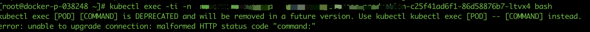
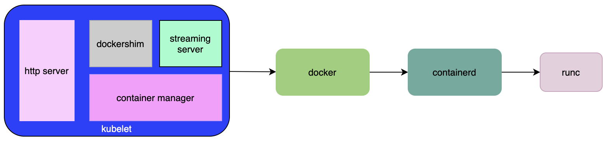
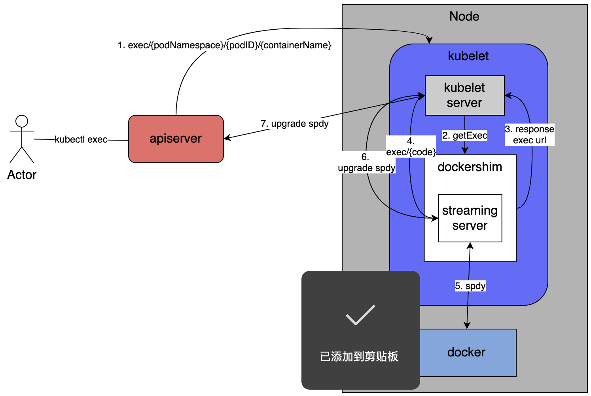
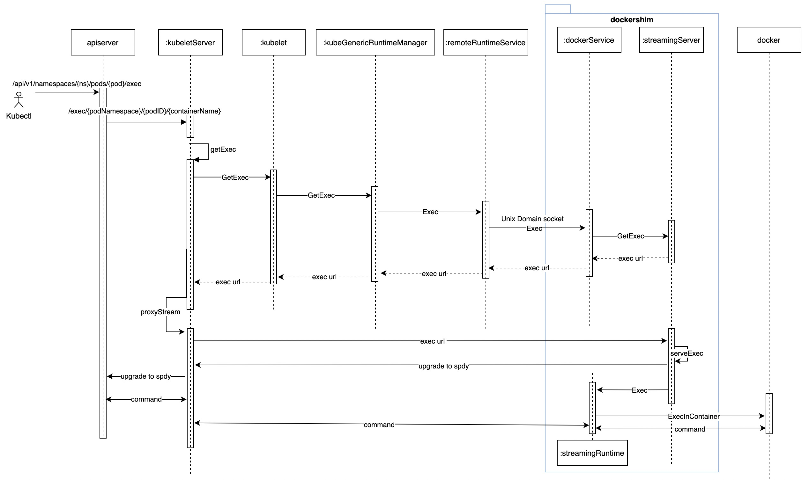
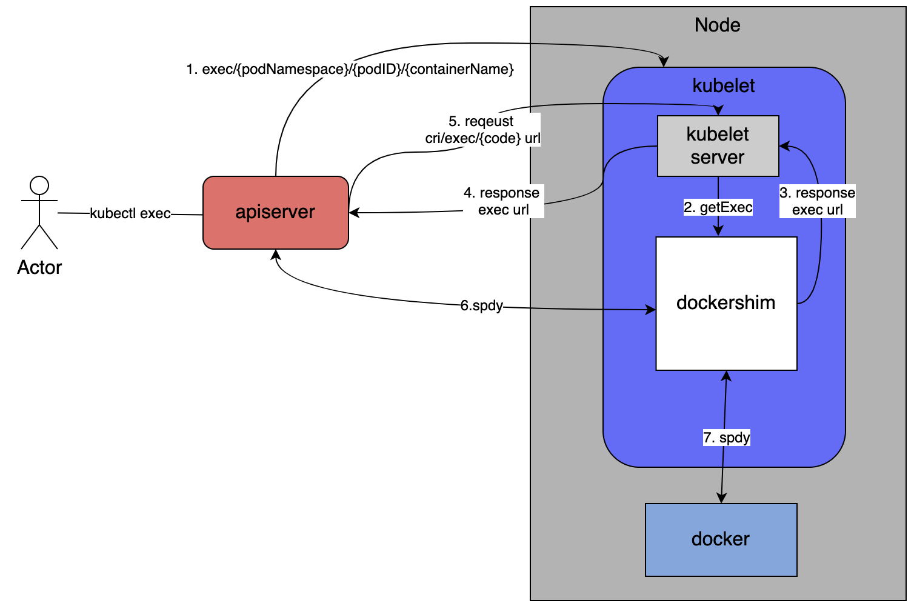

## 问题现象

最近，在工作想要使用 kubectl exec 进入容器排查问题，结果返回下面异常：



## 排查过程

我们知道 kubectl exec 的执行链路是 client -> kube-apiserver -> kubelet -> docker。

登录 Kubelet 宿主机查看 kubelet 错误日志，发现有相同的报错日志，这说明是 kubelet 和 docker 之间链路又问题。通过 kubelet 日志中不能定为到问题具体原因。然后，我们试图通过抓包，希望在数据包中能发现一些线索。

在抓包数据结果中我们发现关键字为 exec 的请求，该会话的目的地址为 A:20880, http header 中 Host 为 B:10250 （也就是是物理机上 kubelet 的 httpserver 地址）。我们查询 A 这个IP，发现是业务应用的容器 IP。

这就比较奇怪了，正常 apiserver 发送 exec 请求为什么转发到了容器的 20880 端口。并且数据包中包含 kubectl ("User-Agent: kubectl") http header。难道 kubectl exec 请求发送到 docker 的请求（xxxx/exec/token）被转发到了容器。通过再次尝试执行 kubectl exec 并抓包，发现执行命令和发送到 20880 端口请求匹配，这验证了我们的猜测。

到此就把问题范围缩小到宿主机网络上，我们知道 kube-proxy 会通过 ipvs 或 iptables 对创建的 nodeport 或 service vip 的请求进行拦截和转发。我们查看 conntrack 请求记录：


发现一条请求 127.0.0.1:33589 的记录，并且转发到的地址 A:20880 也和我们抓包的结果匹配。然后查看 33589 端口，发现该端口就是被 kubelet 占用。然后，我们查询 service，发现 33589 端口同时是 B 容器的应用 service 的 nodeport。到此问题根本原因定位到了，nodeport 端口和 kubelet 启动的转发端口冲突了，导致发送 exec 请求转发到了应用容器的 20880 端口（dubbo端口）。

## 继续深挖

事情到此并没有结束，上面我们只是定位到了具体问题原因。其实还存在两个问题：

1. 对 kubectl exec 的执行过程还没没挖透；
2. 如何避免该问题？

### kubectl exec 的执行过程

问题没有快速定位，主要原因还是对 kubectl exec 执行流程不熟。下面来了解一下 kubectl 是怎么执行的。

本文基于 1.14.6 源码进行研究。

首先，简单了解一下 kubelet 架构：



kubelet 中有上面几个部分：container manager、dockershim、http server、streaming server。kubelet 早期直接调用 docker api 管理容器，后来为了适配更多的 runtime 抽象出了一个接入层 cri。同时，为了兼容 docker 的 API，kubelet 代码中实现了这个叫 dockershim 的部分。这样就对上层屏蔽了底层 runtime。http server 通常使用 10250 对外提供 API 服务。streaming server 是需要和容器进行交互时的一个代理服务。

在默认情况下，用户执行 kubectl exec 简化流程如下：



1. terminal 中键入 kubectl exec xxx 指令，kubectl 发送请求到 apiserver https://apiserver/api/v1/namespaces/{ns}/pods/{pod}/exec?command=bash&container=dragon-claw&stdin=true&stdout=true&tty=true；
2. apiserver 接到请求后，将请求转发到 kubelet， node:10250/api/v1/exec/{ns}/{podid}/{container}。kubelet httpserver 接收到请求后：
   * 首先，向 dockershim 发起 getExec 请求，返回一个流地址 url （exec/{token}）；
   * 然后，kubelet 请求 exec/xxxx url 到 streaming server，streaming server 接收到请求后，response upgrade 将连接升级成为 spdy 或 ws 连接；
3. kubelet 收到 upgrade reponse 后，将该 reponse 直接返回给 apiserver，到此 apiserver -> kubelet -> streaming server -> docker 之间整个通道建立完成；
4. 到此，用户可以在 terminal 中键入命令在容器中执行；



其中， streaming server 是 kubelet 和 docker 之间的一个桥梁，他负责将请求转发给 docker（或者其他 runtime）。kubelet 访问 streaming server 的地址就是 127.0.0.1:{streaming sever port}。

**而我们遇到问题中端口冲突，就是 streaming server 端口和 nodeport 冲突。kubelet 拿到 exec url 后，命中本地 iptables 规则，然后请求被转发到了 nodeport 关联的容器，返回上述错误。**

在源码研究过程中，参数 --redirect-container-streaming 引起了我们的注意：

```
func (s *Server) getExec(request *restful.Request, response *restful.Response) {
    .... 省略若干代码....
    url, err := s.host.GetExec(podFullName, params.podUID, params.containerName, params.cmd, *streamOpts)
    if err != nil {
        streaming.WriteError(err, response.ResponseWriter)
        return
    }
    if s.redirectContainerStreaming {
        http.Redirect(response.ResponseWriter, request.Request, url.String(), http.StatusFound)
        return
    }
    proxyStream(response.ResponseWriter, request.Request, url)
}
```

该参数开启后会并不会进行 proxyStream。而是直接向 apiserver 发送 302 跳转，流程变为如下：



该参数说明，如下：

```
--redirect-container-streaming  Enables container streaming redirect. If false, kubelet will proxy container streaming data between apiserver and container runtime; if true, kubelet will return an http redirect to apiserver, and apiserver will access container runtime directly. The proxy approach is more secure, but introduces some overhead. The redirect approach is more performant, but less secure because the connection between apiserver and container runtime may not be authenticated.
```

另外，在 1.18 版本中我们发现该参数即将废弃，社区中已经在 kep [Cleaning up container streaming requests](https://github.com/kubernetes/enhancements/tree/master/keps/sig-node/1558-streaming-proxy-redirects#dependence-on-apiserver-redirects)中详细说明了后续下线计划（1.18 进行下线提示、1.20版本参数失效、1.22 参数被删除）。后续 apiserver 无法直接和 dockershim 通信。

### 如何避免端口冲突

经过源码阅读，我们了解了执行 kube exec 的流程，通过关闭 streaming server 可以避免 streaming server 端口和 nodeport 冲突。但是该方案只能在 1.20 版本前的集群中使用。

另外，进一步思考，如果其他进程使用了一个随机端口是否也会出现该问题呢？

还是有一定冲突概率的，在 [#85418](https://github.com/kubernetes/kubernetes/issues/85418) issue 中就有人提出了该问题，从相关讨论中推荐解决方法是通过宿主机预留端口（net.ipv4.ip_local_port_range）解决。k8s apiserver 默认的 nodeport 端口范围为 30000-32767 （通过 --service-node-port-range 参数配置），一般宿主机 net.ipv4.ip_local_port_range 默认范围为 32768-60999。而我们出现冲突，因为使用的某云 k8s 集群修改了 apiserver 参数为 30000-50000，导致出现端口冲突问题。

其实，kube-proxy 为了避免端口冲突的问题，运行过程会监听所有的 nodeport 端口。但是，这存在一个鸡生蛋的问题。如果某个 nodeport 分配前已经被其他应用占用，或者 kube-proxy 重启，还是会存在端口冲突的问题。在 [#100643](https://github.com/kubernetes/kubernetes/issues/100643) issue 中也进行了相关讨论，希望后续能有完美的解决方案。

综上，目前解决方案下面几种：

1. 1.20 前版本可以通过 --redirect-container-streaming 关闭 steaming server，避免 kubelet 和 nodeport 端口冲突；
2. 修改系统参数和 apiserver 端口范围，保证和宿主机随机端口范围不重合；
3. 其他技术，例如 [#100643](https://github.com/kubernetes/kubernetes/issues/100643) issue 中提出的 ebpf。

## 总结

通过一个生产 `` kubectl exec ``异常问题，我们了解了执行 exec 命令后，整个底层转发逻辑：

1. apiserver 查询到 pod 所在 node ip，通过 nodeip:10250 端口向 kubelet 发起请求；
2. kubelet 接收到请求后，向本地 runtime 获取 exec url。然后，1.20 之前会基于参数 --redirect-container-streaming 有两种处理流程：
   1. 开启参数，通过 302 跳转方式，将 apiserver 请求重定向到 exec url；
   2. 关闭参数，会先直接和 runtime 建立 exec 通道，然后将 apiserver 请求升级为 spdy 或 ws 连接；
3. 后续 apisever 和 runtime 通道建立完成，client 就可以在 terminal 上执行命令了。


