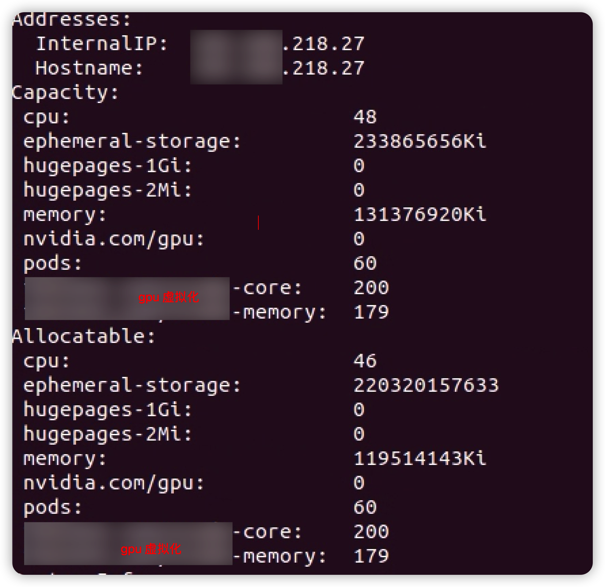

## 问题背景

我们在  kubernetes  生产环境上了 GPU 虚拟化后，对原生的 kube-scheduler 进行了扩展，支持  GPU 虚拟化相关调度算法。在 GPU 扩展调度组件上线后，部署推理 业务容器时，出现了 pod 一直处于 Pending 状态。查看 Pending  Pod 的 event 日志，提示 pod 资源不足而导致 pod 调度失败。


查看 event 日志，可以看出是节点 cpu 资源不足导致。但是，我们通过 describe gpu node 返回结果可以看到 GPU、CPU、memory 等资源都非常充足。



并且，非 gpu 节点并没有发现类似的问题。

## 问题定位

为了定位是否是引入 GPU 扩展调度组件导致的，我们修改了 gpu 容器 request 资源，去掉虚拟化 gpu 的配额并且强制调度到 218.27 这台node，容器仍然 Pending。

到现在仍然不能排除是增加 GPU 扩展调度组件引起的问题，虽然这个组件在上线前在线下做了较久时间的验证都没有出现该问题。我们在 playbox 环境中环境尝试复现该问题，经过多次同样问题出现了。为了定位到具体原因，我们将 kube-scheduler 的日志级别调到最高，希望通过观察日志能够定位到问题的根源。


我们发现扩容时存在某些 pod 会出现两次调度的情况，pod 虽然最终调度成功并且处于 running 状态，但是仍然出现过调度失败的日志：

```
I0624 13:11:39.054874 7225 event.go:209] Event(v1.ObjectReference{Kind:"Pod", Namespace:"gpu", Name:"gpu-work-85bb88797b-7zf85", UID:"22f6a277-2812-49af-b12f-6759e47920d4", APIVersion:"v1", ResourceVersion:"11045409", FieldPath:""}): t ype: 'Warning' reason: 'FailedScheduling' 0/5 nodes are available: 4 Insufficient xxxx-core, 4 Insufficient xxx-memory.
```

这给我们带来了以下疑问：

1. 同一个 pod 为什么会出现两次调度？
2. 为什么 pod 调度成功，也出现了调度失败的事件呢？
3. 其他 pod 调度失败是否和 pod 出现两次调度有关系？

### 原因排查

#### 一个 pod 为什么会出现两次调度？

我们只使用了 kube-scheduler 的  predicate extender，pod 在 k8s scheduler 默认的 predicate 流程执行完成后，会回调 GPU 扩展调度组件完成 GPU 辅助调度，最后优选最优的 node 节点。pod 在回调时，GPU 扩展调度组件会将分配 gpu 设备号和调度的 node 等信息 patch 到 pod annotations 中：

```go
  
func (gpuFilter *GPUFilter) deviceFilter(
......
    annotationMap := make(map[string]string)                                                                                                       
    for k, v := range newPod.Annotations {                                                                                                         
        if strings.Contains(k, util.GPUAssigned) ||                                                                                                
            strings.Contains(k, util.PredicateTimeAnnotation) ||                                                                                   
            strings.Contains(k, util.PredicateGPUIndexPrefix) ||                                                                                   
            strings.Contains(k, util.PredicateNode) {                                                                                              
            annotationMap[k] = v                                                                                                                   
        }                                                                                                                                          
    }                                                                                                                                              
    err := gpuFilter.patchPodWithAnnotations(newPod, annotationMap)                                                                                
    if err != nil {                                                                                                                                
        failedNodesMap[node.Name] = "update pod annotation failed"                                                                                 
        continue                                                                                                                                   
    }                                                                                                                                              
....
}
```

然后，kube-scheduler watch 到 pod update 事件后，会将 pod 重新加入到调度队列：

```go
func (sched *Scheduler) updatePodInSchedulingQueue(oldObj, newObj interface{}) {                                                                              
    pod := newObj.(*v1.Pod)                                                                                                                                   
    if sched.skipPodUpdate(pod) {                                                                                                                             
        return                                                                                                                                                
    }                                                                                                                                                         
    if err := sched.config.SchedulingQueue.Update(oldObj.(*v1.Pod), pod); err != nil {                                                                        
        utilruntime.HandleError(fmt.Errorf("unable to update %T: %v", newObj, err))                                                                           
    }                                                                                                                                                         
}
```

虽然上么有 skipPodUpdate 这个逻辑，但是实际上更新 annotation 后这一步被跳过了，具体后面再讲。

#### 为什么 pod 调度成功，也出现了调度失败的事件呢？

更新后的 podA 重新进入调度队列后，相当于 podA 经过了两次调度循环 A 和 B。由于调度队列的优先级算法，在没有优先级更高的 pod 被创建的情况下，A、B 两个循环是相邻的。

在 node 资源充足的情况下，一个调度循环大概流程：

scheduling queue pop ---> schedule ----> predicate ----> call predicate extender -----> priority ------> asynchronous binding


上图为调度的基本流程。调度器在回调  GPU 扩展调度组件时 pod 属性被修改，update 事件进入 kube-scheduler pod 被重新加入调度队列。pod 在第二次调度过程，会再次回调 GPU 扩展调度组件，我们查看  GPU 扩展调度组件日志，在第二次调度时 response 返回的 filteredNode 为空：

I0628 03:46:20.957317    1 routes.go:81] GPUQuotaPredicate: extenderFilterResult = {"Nodes":null,"NodeNames":null,"FailedNodes":null,"Error":""}

从而 predicate 过程预选可用 node 集合为空，从而报出 0/5 nodes are available: 4 Insufficient xxx-core, 4 Insufficient xxx-memory 错误日志。我们  GPU 扩展调度组件代码中，如果存在 gpu annotations 时会直接返回一个空列表：

```go
//deviceFilter will choose one and only one node fullfil the request,
//so it should always be the last filter of gpuFilter
func (gpuFilter *GPUFilter) deviceFilter(
    pod *corev1.Pod, nodes []corev1.Node) ([]corev1.Node, schedulerapi.FailedNodesMap, error) {
    // #lizard forgives
    var (
        filteredNodes  = make([]corev1.Node, 0)
        failedNodesMap = make(schedulerapi.FailedNodesMap)
        nodeInfoList   []*device.NodeInfo
        success        bool
        sorter         = device.NodeInfoSort(
            device.ByAllocatableCores,
            device.ByAllocatableMemory,
            device.ByID)
    )
 
    for k := range pod.Annotations {
        if strings.Contains(k, util.GPUAssigned) ||
            strings.Contains(k, util.PredicateTimeAnnotation) ||
            strings.Contains(k, util.PredicateGPUIndexPrefix) {
            return filteredNodes, failedNodesMap, nil
        }
    }
 
 
......
}
```

#### 资源充足调度失败原因

通过上面两小节的分析，我们大致了解了场景触发前提：

1.  GPU 扩展调度组件在 kube-scheduler 回调时（调度循环期间），会同时 patch pod annotations 属性；
2. pod 第二次调度循环， GPU 扩展调度组件 response 返回空调度队列；

 然后，我们对 kube-scheduler 代码进行阅读和调试分析，发现 kube-scheduler 存在一个[内存泄漏的bug](https://github.com/kubernetes/kubernetes/issues/86942)。


我们知道，通常情况下 predicate 阶段判断调度失败，kube-scheduler 会进行以下操作：

1. 将 pod 入队 unschedulableQ 从而在下一个调度循环进行调度；
2. 进入 preempt 流程，如果有可抢占的 node ，则标记 pod nominatedName 为被抢占的 node;

另外，nominatedPodMap 中记录的 pod 只在调度成功后 assumed 阶段会被清理。而 assumed 只有在调度循环成功，进入到 bind 阶段前会执行。

```go
// scheduler.go 
func (sched *Scheduler) scheduleOne() {
  ... ...
	// assume modifies `assumedPod` by setting NodeName=scheduleResult.SuggestedHost
	err = sched.assume(assumedPod, scheduleResult.SuggestedHost)
	if err != nil {
		klog.Errorf("error assuming pod: %v", err)
		metrics.PodScheduleErrors.Inc()
		return
	}
	// bind the pod to its host asynchronously (we can do this b/c of the assumption step above).
	go func() {
		// Bind volumes first before Pod
		... ...
		err := sched.bind(assumedPod, &v1.Binding{
			ObjectMeta: metav1.ObjectMeta{Namespace: assumedPod.Namespace, Name: assumedPod.Name, UID: assumedPod.UID},
			Target: v1.ObjectReference{
				Kind: "Node",
				Name: scheduleResult.SuggestedHost,
			},
		})
    ... ...
  }
  ... ...
}
```

如果，pod 调度失败但是并没有入队 unschedulableQ，则 nominated pod map 就存在资源泄漏的问题。

我们看一下 unschedulableQ 入队代码：

```go
... ...
defer runtime.HandleCrash()                                                                                                             
podID := types.NamespacedName{                                                                                                          
    Namespace: pod.Namespace,                                                                                                           
    Name:      pod.Name,                                                                                                                
}                                                                                                                                       

// When pod priority is enabled, we would like to place an unschedulable                                                                
// pod in the unschedulable queue. This ensures that if the pod is nominated                                                            
// to run on a node, scheduler takes the pod into account when running                                                                  
// predicates for the node.                                                                                                             
if !util.PodPriorityEnabled() {                                                                                                         
    if !backoff.TryBackoffAndWait(podID, stopEverything) {                                                                              
        klog.Warningf("Request for pod %v already in flight, abandoning", podID)                                                        
        return                                                                                                                          
    }                                                                                                                                   
}                                                                                                                                       
// Get the pod again; it may have changed/been scheduled already.                                                                       
getBackoff := initialGetBackoff                                                                                                         
for {                                                                                                                                   
    pod, err := client.CoreV1().Pods(podID.Namespace).Get(podID.Name, metav1.GetOptions{})                                              
    if err == nil {                                                                                                                     
        if len(pod.Spec.NodeName) == 0 {                                                                                                
            podQueue.AddUnschedulableIfNotPresent(pod, podSchedulingCycle)                                                              
        }                                                                                                                               
        break                                                                                                                           
    }                                                                                                                                   
    if errors.IsNotFound(err) {                                                                                                         
        klog.Warningf("A pod %v no longer exists", podID)                                                                               
        return                                                                                                                          
    }                                                                                                                                   
    klog.Errorf("Error getting pod %v for retry: %v; retrying...", podID, err)                                                          
    if getBackoff = getBackoff * 2; getBackoff > maximalGetBackoff {                                                                    
        getBackoff = maximalGetBackoff                                                                                                  
    }                                                                                                                                   
    time.Sleep(getBackoff)                                                                                                              
}

... ...
```


图中 a 和 b 分别表示两次调度循环，

1. a.3 (asummed) 之前 pod 更新事件进入，触发 pod 的二次调度；

2. pod 的第二次调度 b predicate 阶段返回 fitsError 错误，从而触发 b.3 调度入队 unschedulableQ，但是这时 pod 在 a 调度循环中完成 node bind 操作，导致  ``(pod.Spec.NodeName != "")``，从而 b.3 没有入队 unschedulableQ；

3.  b 调度循环中 在 b.6 中将 pod 加入 nominated pod map，因为 pod 已经绑定了node 所以后续不会再进行调度，pod 会一直在 nominatedPodMap 中；

接下来，解释以下 nominatedPodMap 的作用。nominatedPodMap 数据结构：

```go
// nominatedPodMap is a structure that stores pods nominated to run on nodes.                                                                                  
// It exists because nominatedNodeName of pod objects stored in the structure                                                                                  
// may be different than what scheduler has here. We should be able to find pods                                                                               
// by their UID and update/delete them.                                                                                                                        
type nominatedPodMap struct {                                                                                                                                  
    // nominatedPods is a map keyed by a node name and the value is a list of                                                                                  
    // pods which are nominated to run on the node. These are pods which can be in                                                                             
    // the activeQ or unschedulableQ.                                                                                                                          
    nominatedPods map[string][]*v1.Pod                                                                                                                         
    // nominatedPodToNode is map keyed by a Pod UID to the node name where it is                                                                               
    // nominated.                                                                                                                                              
    nominatedPodToNode map[ktypes.UID]string                                                                                                                   
}
```

nominatedPodMap 记录了 node 关联的 pod，包括 running 状态和候选 pod。在 pod 调度失败时，会进行 node 抢占，为了避免被抢占的 pod 重新夺回 node 资源，所以，在每次 predicate 阶段会将 nominatedPodMap 中 node 关联的 pod 占用的资源也考虑进去。

```go
func podFitsOnNode() {
......
 for i := 0; i < 2; i++ {                                                                                                                                  
    metaToUse := meta                                                                                                                                     
    nodeInfoToUse := info                                                                                                                                 
    if i == 0 {                                                                                                                                           
        podsAdded, metaToUse, nodeInfoToUse = addNominatedPods(pod, meta, info, queue)                                                                    
    } else if !podsAdded || len(failedPredicates) != 0 {                                                                                                  
        break                                                                                                                                             
    }                                                                                                                                                     
.....
}
```


```go
// addNominatedPods adds pods with equal or greater priority which are nominated                                                                              
// to run on the node given in nodeInfo to meta and nodeInfo. It returns 1) whether                                                                           
// any pod was found, 2) augmented meta data, 3) augmented nodeInfo.                                                                                          
func addNominatedPods(pod *v1.Pod, meta predicates.PredicateMetadata,                                                                                         
    nodeInfo *schedulernodeinfo.NodeInfo, queue internalqueue.SchedulingQueue) (bool, predicates.PredicateMetadata,                                           
    *schedulernodeinfo.NodeInfo) {                                                                                                                            
    if queue == nil || nodeInfo == nil || nodeInfo.Node() == nil {                                                                                            
        // This may happen only in tests.                                                                                                                     
        return false, meta, nodeInfo                                                                                                                          
    }                                                                                                                                                         
    nominatedPods := queue.NominatedPodsForNode(nodeInfo.Node().Name)                                                                                         
    if nominatedPods == nil || len(nominatedPods) == 0 {                                                                                                      
        return false, meta, nodeInfo                                                                                                                          
    }                                                                                                                                                         
    var metaOut predicates.PredicateMetadata                                                                                                                  
    if meta != nil {                                                                                                                                          
        metaOut = meta.ShallowCopy()                                                                                                                          
    }                                                                                                                                                         
    nodeInfoOut := nodeInfo.Clone()                                                                                                                           
    for _, p := range nominatedPods {                                                                                                                         
        if util.GetPodPriority(p) >= util.GetPodPriority(pod) && p.UID != pod.UID {                                                                           
            nodeInfoOut.AddPod(p)                                                                                                                             
            if metaOut != nil {                                                                                                                               
                metaOut.AddPod(p, nodeInfoOut)                                                                                                                
            }                                                                                                                                                 
        }                                                                                                                                                     
    }                                                                                                                                                         
    return true, metaOut, nodeInfoOut                                                                                                                         
}
```

至此，我们也分析清楚了资源泄露的问题。

查看 kubernetes 代码，在 1.18 版本中已经对次问题进行了优化，在pr [#86230](https://github.com/kubernetes/kubernetes/pull/86230) 中进行了修复。修复逻辑也比较简单：

```go
func (sched *Scheduler) scheduleOne(ctx context.Context) {
	fwk := sched.Framework

	podInfo := sched.NextPod()
	// pod could be nil when schedulerQueue is closed
	if podInfo == nil || podInfo.Pod == nil {
		return
	}
	pod := podInfo.Pod
	if sched.skipPodSchedule(pod) {
		return
	}
	...
}
```

在 Pod 进入调度循环前，再次进行 ``skipPodSchedule`` 判断，这个函数我们上面提到过，在 scheduler 捕获到 pod Update 事件后，会执行这个函数：

```golang
// scheduler/eventhandlers.go
func (sched *Scheduler) updatePodInSchedulingQueue(oldObj, newObj interface{}) {
	pod := newObj.(*v1.Pod)
	if sched.skipPodUpdate(pod) {
		return
	}
	if err := sched.config.SchedulingQueue.Update(oldObj.(*v1.Pod), pod); err != nil {
		utilruntime.HandleError(fmt.Errorf("unable to update %T: %v", newObj, err))
	}
}
```

``skipPodSchedule``函数逻辑:

```go
// skipPodUpdate checks whether the specified pod update should be ignored.
// This function will return true if
//   - The pod has already been assumed, AND
//   - The pod has only its ResourceVersion, Spec.NodeName and/or Annotations
//     updated.
```

pod 被 assumed 是 pod 成功选择要调度的 Node 后，加入调度器中 assumed cache  中，后面就可以进行异步的 bind 操作。assumed cache 会在 bind 结束 30s 后进行清理。

```go
// assume signals to the cache that a pod is already in the cache, so that binding can be asynchronous.
// assume modifies `assumed`.
func (sched *Scheduler) assume(assumed *v1.Pod, host string) error {
	// Optimistically assume that the binding will succeed and send it to apiserver
	// in the background.
	// If the binding fails, scheduler will release resources allocated to assumed pod
	// immediately.
	assumed.Spec.NodeName = host

	if err := sched.config.SchedulerCache.AssumePod(assumed); err != nil {
		klog.Errorf("scheduler cache AssumePod failed: %v", err)
    ... ...
  }
  ... ...
}
		
```

上面说过我们在 update pod annotations 是在 predicate 阶段，会有一定概率 update 早于 assumed 操作，导致再次加入调度循环。

## 修复方案

了解了整个问题的原委，目前有两种修复方案：

1. k8s 组件方面：
   1. 升级 k8s 到 1.18+ 版本；
      1. 1.14 和 1.18 功能特性变化较大存在较多不确定性，升级成本较高
2.  GPU 扩展调度组件层面进行修改：
   1. 在第二次调度时，判断已经调度时  GPU 扩展调度组件并不是返回空 node 列表，而是返回 error 错误；
      1. 能够避免问题 bug 的触发，但是会存在一定的 schedulefailed event 日志；

最后，经过总和考虑，我们采用“方案2”进行修复。

## 相关参考

1. https://github.com/kubernetes/kubernetes/pull/86230
2. https://github.com/kubernetes/kubernetes/issues/86942
