## 背景

近日，接连收到多个云上站点业务出现 502 问题反馈：

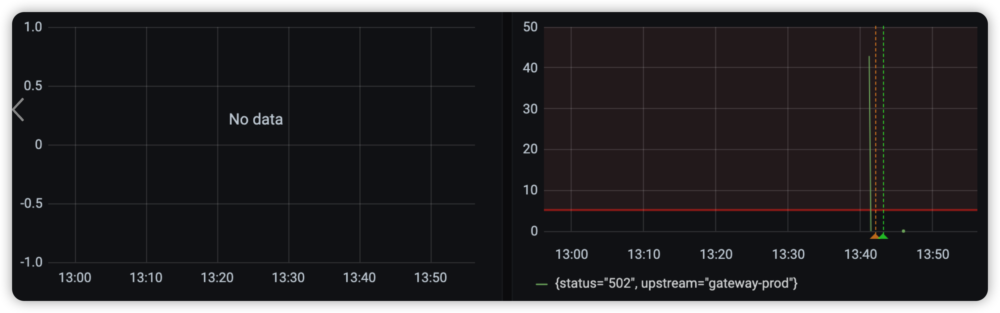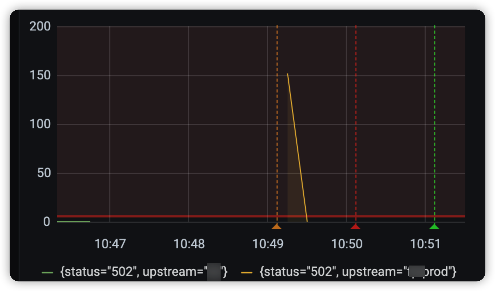

和业务负责人沟通后，应用确认加入了优雅下线逻辑。

## 排查过程

首先，查看网关日志：

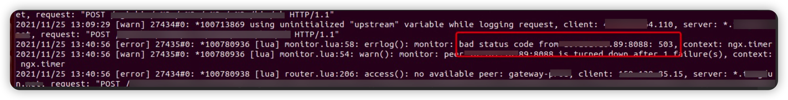

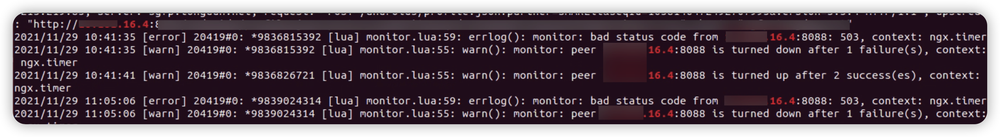

两次日志，都是请求  LB IP 出现 503 错误码后，然后网关将 LB IP 摘掉。

分析为什么出现 503 错误码前，先了解一下容器下线逻辑：容器进行下线时，会调用 prestop 脚本执行下线前的操作。

在 prestop 脚本中，首先 sleep 15s （不要问我为什么），然后调用 http://127.0.0.1:${APP_PORT}/ok.htm?down=true 接口通知 java 进程进行优雅下线。该接口调用成功后，再请求应用 ok 页面，进入下面逻辑：

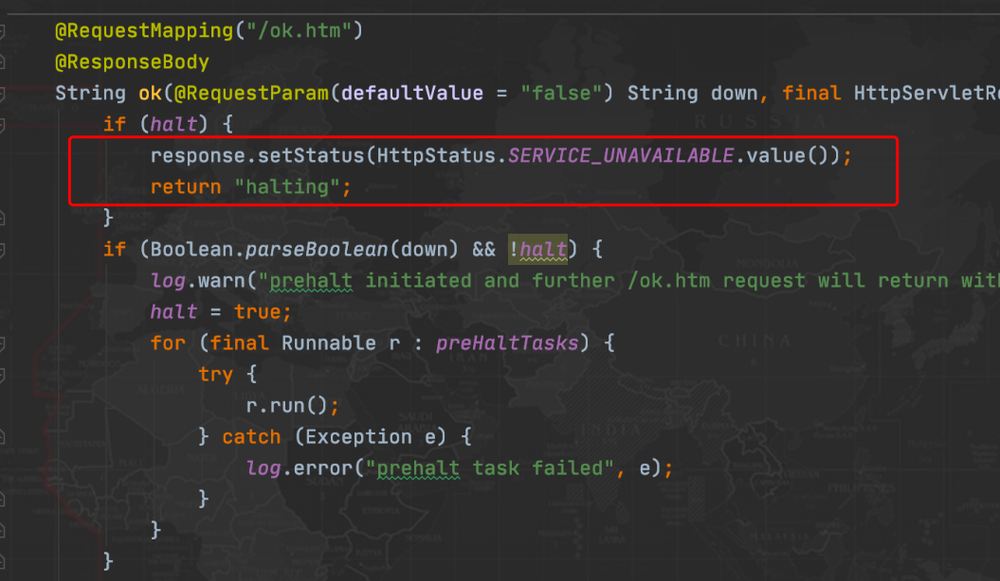

也就是返回 halting 数据和503状态码。

k8s 中在将 Pod 进行下线（标记为 Terminating 状态）时，k8s endpoint controller 就将该 Pod ip 从 lb 或 service 后端列表中摘除。既然 lb/svc 已经将在该 pod IP 摘除，为什么仍然请求到 halting Pod 呢？

在进入应用容器中进行抓包，并和应用负责人确认后，网关 -> lb -> pod 是使用 http 长连接方式。

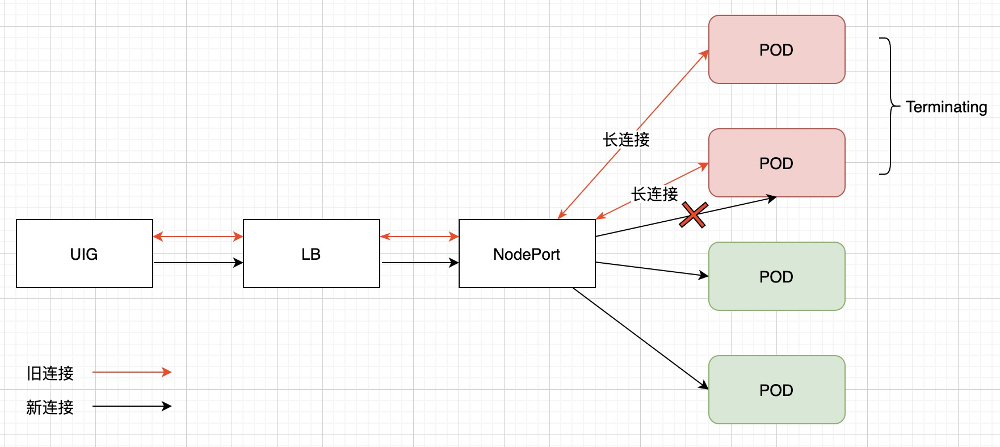

在 Pod 处于 terminating 状态时，通过 svc 请求时新建立的连接将不会转发到该 pod，但是已经建立的连接在 Pod 完全删除前仍可继续通信。所以，虽然 service 将 Pod IP 摘除，但是为了保证容器的优雅下线，已经建立的连接仍然可以继续处理业务，直到容器彻底被删除。

我们用 python 简单写了一个使用 http 长连接客户端，进行一下测试：

```python
import requests 
import time 
client=requests.session()
headers = {'Content-Type': 'application/json', 'Connection': 'keep-alive'} 
while True:    
	r=client.get("http://xx.xx.16.137:8088/ok.htm", headers=headers) 
	# xx.xx.16.137 为应用 lb IP    
	print r.status_code    
	print r.content    
	time.sleep(1)
```

python client 请求应用容器：

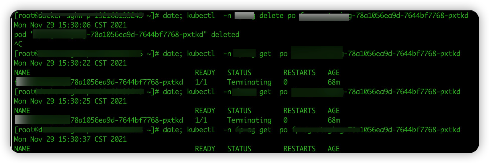

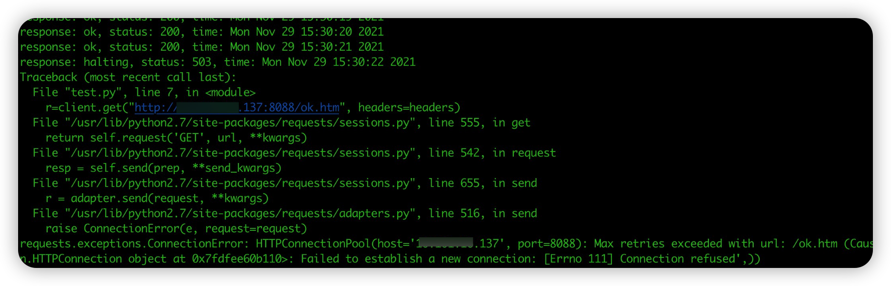

上面可以看到，在 15:30:06 将 pod 进行 kill 后，通过长连接仍然可以将请求转发到处于 terminating 的应用容器。直到 15s 后调用下线接口，请求返回 503。请求处于 halting 状态的 pod，server 端会主动 close 请求：

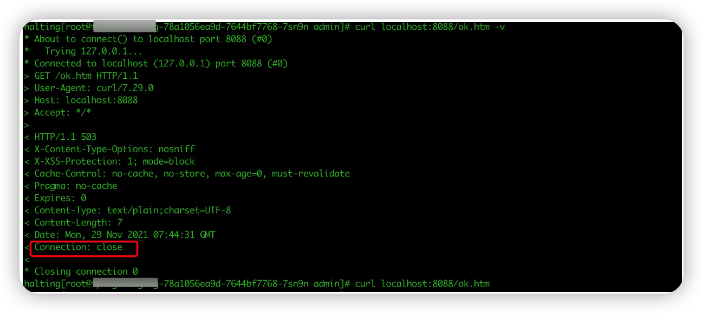

另外，我们测试应用只有单个实例，也就是实例被删除后，lb 后端实例为 0，请求 lb 的新连接无法建立。所以，测试脚本会出现 connect refused 报错。

## 解决方法

综上可知，问题原因是 kill pod 后仍然会有流量进入到 terminating 状态的 pod，然后 15s 后 prestop 脚本通知进程进行下线逻辑（也就是 ok 页面返回 halting 和 503 状态码），当网关继续请求到该 pod 就会认为 lb 出现异常，将唯一的 lb 标记为不健康，从而出现 502 异常。

其他站点未出现该问题原因是：网关直接转发到 pod ip，摘掉的是出现异常的 pod ip 。而有问题的站点对接的只是一个公有云 LB ip。

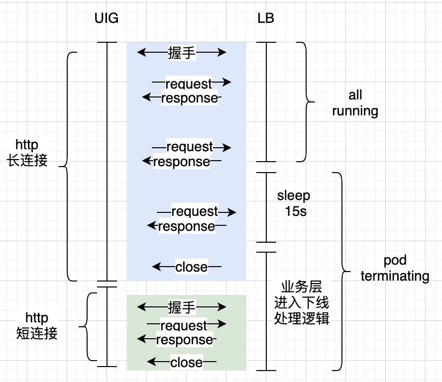

具体优化逻辑如下(如上图，针对单个pod):

1. 应用增加 connection filter，在应用进入优雅下线（被调用 http://127.0.0.1:${APP_PORT}/ok.htm?down=true）后，所有请求的 http 响应头中增加 connection:close（也就是使用短连接）；
   1. 因为 pod 处于 terminating 时，新连接不会进入该 pod；
   2. 参考代码如下：
      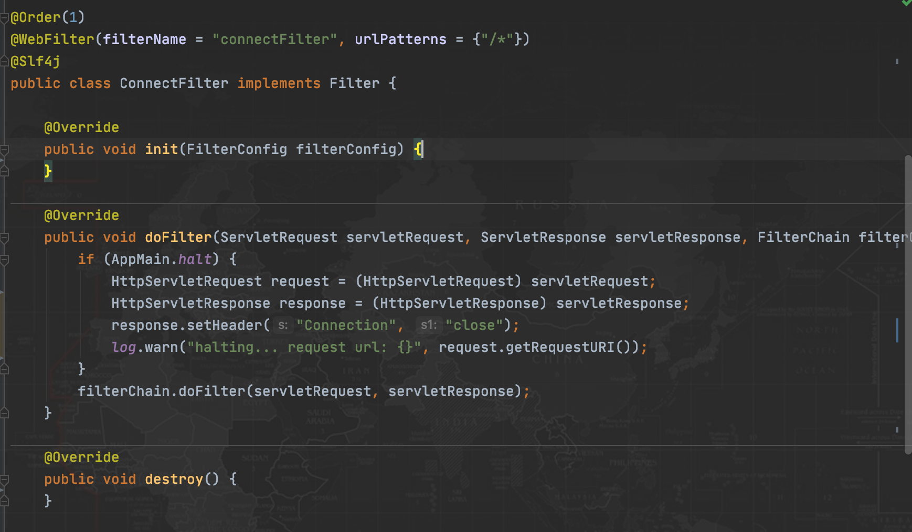
2. 健康检查接口，修改为去掉 503 异常，避免网关检测到 503 异常时，直接摘掉 lb ip。
   1. 参考代码如下：
      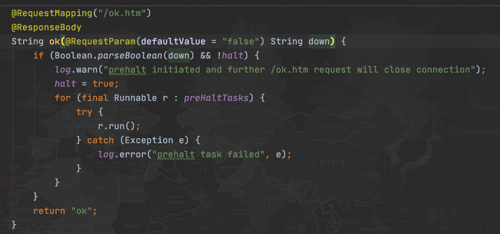

