## 问题描述

AI 应用在迁移到 k8s 部署后发现应用在启动阶段耗时长，且非常容易失败，查看日志发现应用包找不到 GPU 设备问题。

## 问题分析

排查发现出现问题主要在开启了 kubelet static 节点，频繁的出现业务发布失败的情况，报错信息：

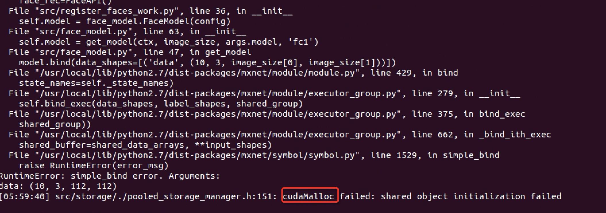

我们进行了一些研究，发现 kubernetes 社区（参考2）和 nvidia-docker （参考3）有相关 issue 讨论，在讨论中 nvidia 员工 [klueska](https://github.com/klueska) 给出了具体原因：

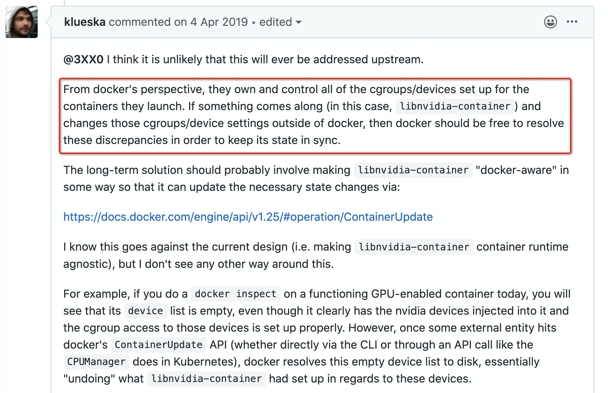

究其根本，是 nvidia-plugin 在容器启动前会通过 nividia-docker runtime 将 gpu device mount 到容器内部，这些 mount 信息对 docker 是不可见的。我们把 kubernetes 的内核绑定参数 CPUManager=static 开启后，kubelet CPUManager 会定期 update 容器 cpuset cgroup 配置，这时上面 nvidia mount 的 device 被清除，导致无法分配 gpu 。nvidia-plugin 通过[在 kubelet 调用 Allocate 接口时返回 device 列表](https://github.com/NVIDIA/k8s-device-plugin/commit/ea604b28beccf9eaf45f3b26ce01c6821b3fa4a6)，修复了该bug。

summarize：已定位到原因，nvidia 的 k8s 插件和 k8s 绑核功能不兼容导致，需要升级 nvidia 插件。

## 验证

我们在线下搭建了 gpu 环境，分别使用 10.57.33.30、10.57.33.31 两台机器做对比测试。首先，我们替换 Nvidia daemonset 容器镜像为修复后的版本 ps/nvidia/nvidia/k8s-device-plugin:1.0.0-beta6，并且修改 daemonset 的升级策略为 OnDelete，这样删除 33.30 机器上 Nvidia pod ，新建的 pod 使用的镜像为升级后的版本。

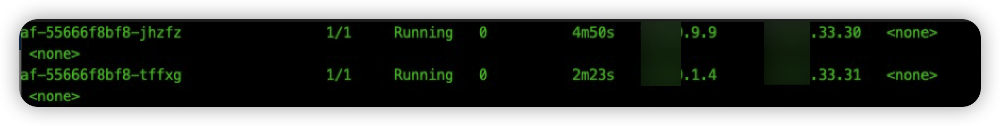

### 有问题插件验证

我们测试 33.31 上的 ai-face-gen 应用，进入 pod 内部，执行命令 nvidia-smi ，会报 nvm unknown error：

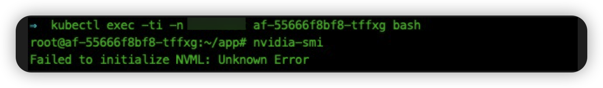

我们安装参考3中的相关描述，docker inspect 容器，查看一下挂载的 devices 列表：

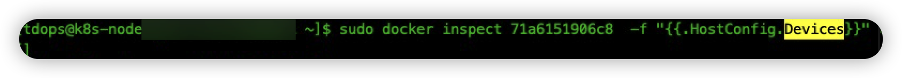

会发现列表为空。然后，我们测试升级后应用报错场景。删除 pod af-55666f8bf8-tffxg，容器重建后的 pod 出现启动失败：

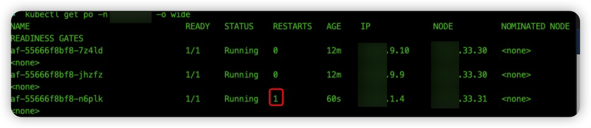

查看应用日志，报错和线上场景相同：

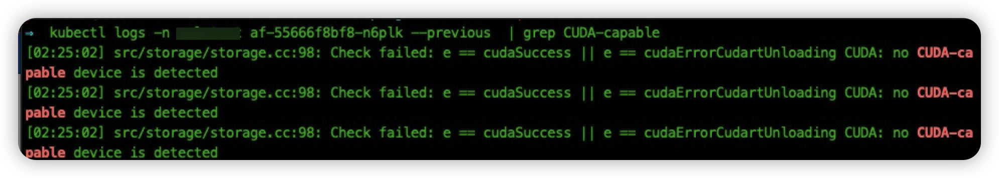

### 升级新版插件验证

我们首先将 33.30 机器的 nvidia-plugin 升级到最新版本（其中1.11 版本为内部的版本号，1.0.0-beta6 为社区修复gpu 问题的最新版本）：

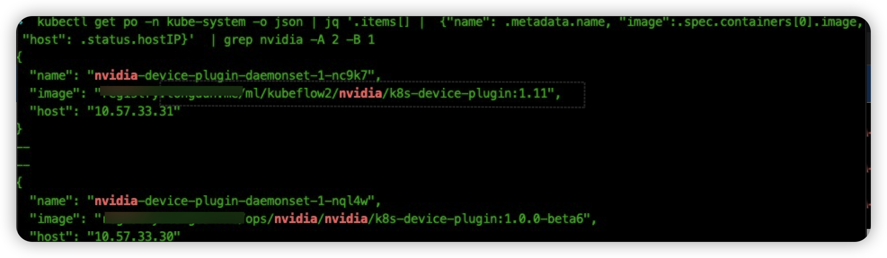

然后和上面同样的操作流程，我们首先进入容器 af-55666f8bf8-7z4ld 内部执行命令 nvidia-smi：

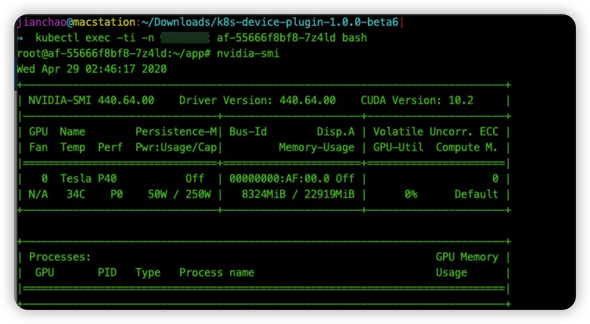

可以发现命令执行正常。然后 同样使用 docker inspect 命令查看容器挂载 device 列表：

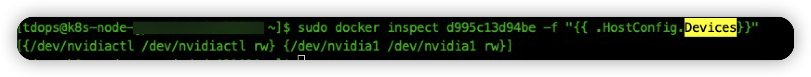

device 列表中挂载了 gpu 显卡和相关驱动。最后，我们删除一下容器 af-55666f8bf8-7z4ld，验证一下容器发布是否会出现失败的情况：

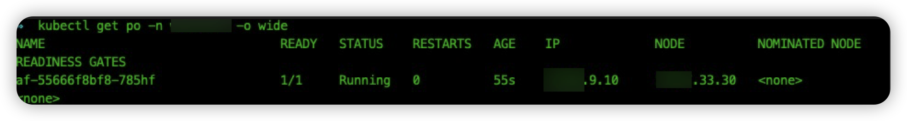

pod 启动正常，执行 nvidia-smi 命令正常：

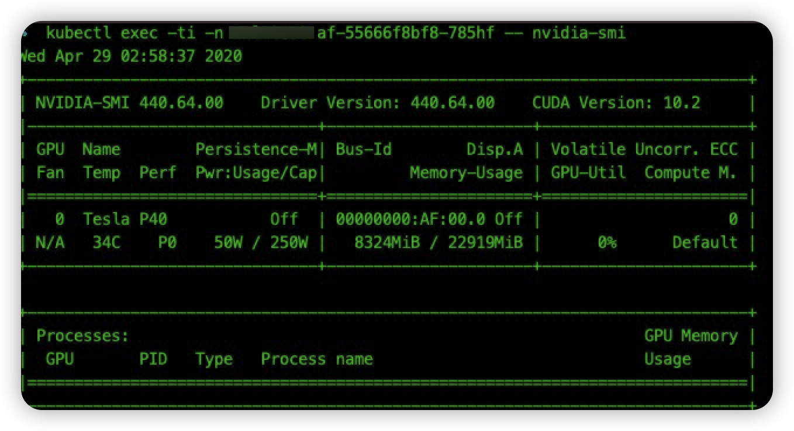

## 参考

1. [Nvidia GPU如何在Kubernetes 里工作](https://zhuanlan.zhihu.com/p/58919502)
2. [Updating cpu-manager-policy=static causes NVML unknown error](https://github.com/kubernetes/kubernetes/issues/77073)
3. [NVIDIA NVML Driver/library version mismatch](https://stackoverflow.com/questions/43022843/nvidia-nvml-driver-library-version-mismatch)
4. [解决Driver/library version mismatch](https://comzyh.com/blog/archives/967/)
5. [升级 nvidia 驱动](https://linuxconfig.org/how-to-install-nvidia-cuda-toolkit-on-centos-7-linux)
6. https://developer.download.nvidia.cn/compute/cuda/repos/rhel7/x86_64/
7. https://developer.download.nvidia.cn/compute/cuda/repos/rhel7/x86_64/cuda-rhel7.repo
